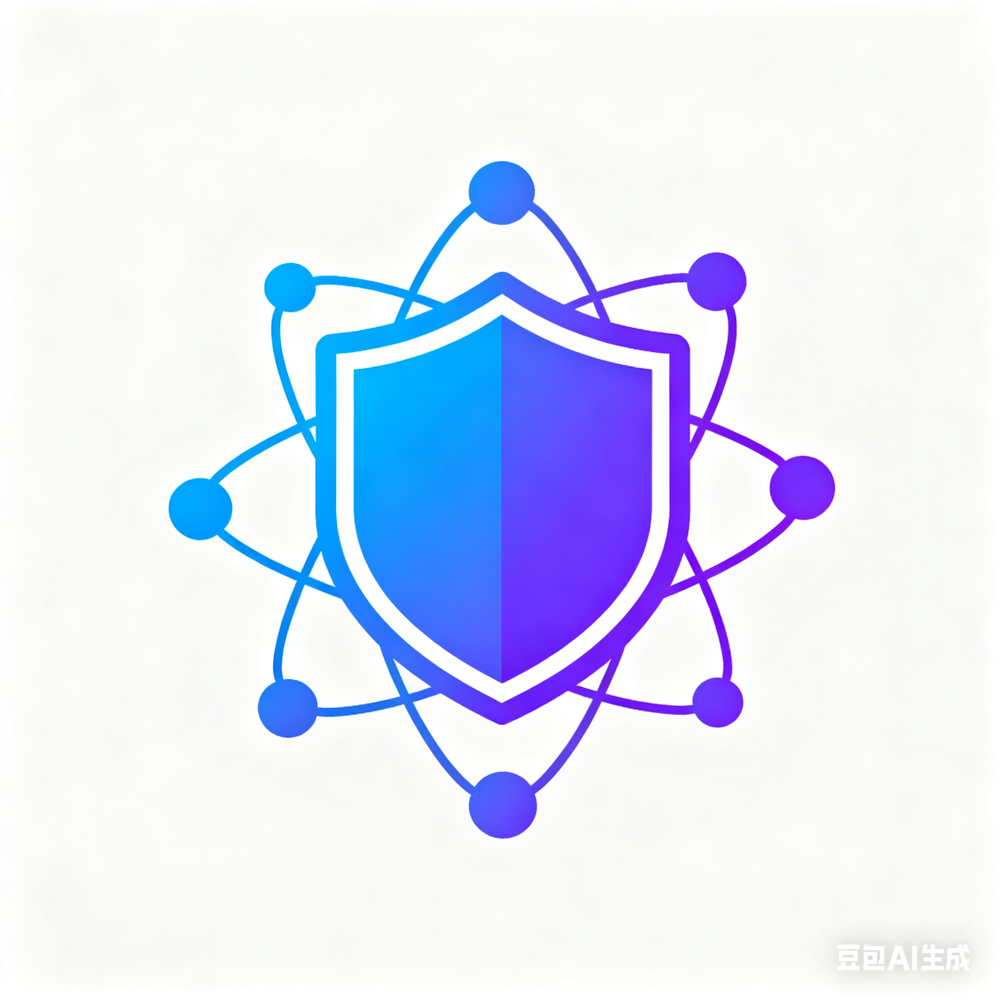

<p align="center">
  
</p>

<h1 align="center">QuantaID</h1>

<p align="center">
  <strong>下一代统一身份认证与访问控制平台</strong>
</p>

<p align="center">
  <a href="https://github.com/turtacn/QuantaID/actions"></a>
  <a href="https://github.com/turtacn/QuantaID/blob/main/LICENSE"></a>
  <a href="https://golang.org/"></a>
  <a href="https://github.com/turtacn/QuantaID/releases"></a>
  <a href="https://goreportcard.com/report/github.com/turtacn/QuantaID"></a>
</p>

<p align="center">
  <a href="README.md">English</a> |
  <a href="#安装">安装</a> |
  <a href="docs/architecture.md">架构文档</a> |
  <a href="docs/apis.md">API 参考</a> |
  <a href="#贡献">贡献指南</a>
</p>

---

## 🎯 项目使命

QuantaID 通过提供**轻量化**、**插件化**、**标准兼容**的统一认证平台，革新企业身份管理。它解决了身份系统碎片化、高定制化成本以及复杂集成挑战等企业环境中的关键痛点。

## 🌟 为什么选择 QuantaID？

在当今复杂的企业环境中，组织面临着：

- **高定制化成本**：每个身份集成都需要数周的定制开发
- **组件复用受限**：认证组件无法在不同产品间轻松共享
- **用户体验碎片化**：用户需要管理多个系统的不同凭证
- **合规挑战**：全球部署中安全基线不统一
- **技术债务累积**：传统认证系统成为维护噩梦

**QuantaID 将这些挑战转化为竞争优势：**

| 挑战 | QuantaID 解决方案 | 业务价值 |
|------|------------------|----------|
| 🔧 定制开发 | 配置驱动架构 | 交付时间减少 60% |
| 🔄 复用受限 | 插件生态 & SDK | 跨产品代码复用率 90% |
| 🌍 全球部署 | 多形态交付 | 简化国际化扩张 |
| 🔒 安全基线 | 标准兼容核心 | 统一合规态势 |
| 🏗️ 技术债务 | API 优先设计 | 面向未来的架构 |

## 🚀 核心特性

### 🔐 **通用认证引擎**
- **多协议支持**：OAuth 2.1、OIDC、SAML 2.0、LDAP/LDAPS、RADIUS
- **无密码认证**：WebAuthn/FIDO2 支持
- **自适应 MFA**：基于风险的多因素认证

### 🔌 **插件优先架构**
- **可扩展连接器**：自定义身份源集成
- **可视化流程编排**：拖拽式认证工作流
- **多语言 SDK**：Go、Java、Node.js、Python、C++

### 🏢 **企业级功能**
- **身份生命周期管理**：自动化用户供应/取消供应
- **细粒度授权**：RBAC/ABAC/ReBAC 支持
- **全面审计**：结构化日志和合规报告
- **高可用性**：集群部署与自动故障转移

### 📦 **灵活部署模式**
- **独立二进制**：零依赖部署
- **容器优先**：Kubernetes 原生，支持 Helm 图表
- **SDK/库**：性能关键场景的深度集成
- **云端 & 本地**：支持混合环境

## 📊 架构概览

```mermaid
graph TB
    subgraph CL[客户端层]
        WEB[Web 界面]
        CLI[命令行工具]
        SDK[多语言 SDK]
    end
    
    subgraph AL[API 网关层]
        GW[API 网关]
        AUTH[认证中间件]
        RATE[限流器]
    end
    
    subgraph SL[服务层]
        ORE[编排引擎]
        AUE[认证引擎]
        AZE[授权引擎]
        IMS[身份管理]
        FED[联邦服务]
    end
    
    subgraph PL[插件层]
        IDP[身份提供商]
        MFA[MFA 提供商]
        CON[自定义连接器]
    end
    
    subgraph DL[数据层]
        PG[(PostgreSQL)]
        RD[(Redis 缓存)]
        ES[(Elasticsearch)]
    end
    
    CL --> AL
    AL --> SL
    SL --> PL
    SL --> DL
````

详细架构文档请参见 [docs/architecture.md](docs/architecture.md)。

## 🛠️ 快速入门

为了快速、轻松地完成本地环境设置，请遵循我们的 **[快速入门指南 (Quickstart Guide)](quickstart.md)**。

该指南将引导您在 5 分钟内完成克隆仓库、构建二进制文件以及运行服务器及其依赖项的全部过程。

## 📖 使用示例

### 基础认证设置

```go
package main

import (
    "context"
    "log"
    "github.com/turtacn/QuantaID/pkg/client"
    "github.com/turtacn/QuantaID/pkg/types"
)

func main() {
    // 初始化 QuantaID 客户端
    qid, err := client.New(client.Config{
        Endpoint: "https://your-quantaid-instance.com",
        APIKey:   "your-api-key",
    })
    if err != nil {
        log.Fatal(err)
    }

    // 配置 OIDC 提供商
    provider := &types.IdentityProvider{
        Name:     "corporate-sso",
        Type:     "oidc",
        Enabled:  true,
        Config: map[string]interface{}{
            "issuer_url":     "https://your-corp-sso.com",
            "client_id":      "quantaid-client",
            "client_secret":  "your-secret",
            "scopes":         []string{"openid", "profile", "email"},
        },
    }
    
    ctx := context.Background()
    if err := qid.IdentityProviders.Create(ctx, provider); err != nil {
        log.Fatal(err)
    }
    
    // 开始认证流程
    authURL, err := qid.Auth.GetAuthorizationURL(ctx, &types.AuthRequest{
        Provider:    "corporate-sso",
        RedirectURI: "https://your-app.com/callback",
        State:       "random-state-string",
    })
    if err != nil {
        log.Fatal(err)
    }
    
    log.Printf("重定向用户到: %s", authURL)
}
```

### CLI 使用示例

```bash
# 配置 LDAP 身份源
qid identity-sources add ldap \
  --name "corporate-ad" \
  --host "ldap.corp.com" \
  --port 636 \
  --use-tls \
  --bind-dn "cn=service,ou=apps,dc=corp,dc=com" \
  --bind-password "secret"

# 设置 SAML 应用
qid applications create saml \
  --name "aws-sso" \
  --acs-url "https://signin.aws.amazon.com/saml" \
  --entity-id "https://signin.aws.amazon.com/saml" \
  --attribute-mapping "email:urn:oid:1.2.840.113549.1.9.1"

# 配置自适应 MFA 策略
qid policies create \
  --name "high-risk-mfa" \
  --condition "risk_score > 0.7 OR location.country != 'trusted'" \
  --action "require_mfa:totp,webauthn"

# 监控认证指标
qid metrics auth --since "24h" --group-by provider
```

### 命令行演示效果

使用以下提示生成演示 GIF：

1. **基础设置演示**：录制 `qid-demo setup --interactive` 展示配置向导
2. **身份源集成**：录制 `qid-demo connect ldap --wizard` 逐步 LDAP 设置
3. **策略配置**：录制 `qid-demo policy create --visual` 展示拖拽式策略构建器
4. **实时监控**：录制 `qid-demo monitor --dashboard` 显示实时认证指标

## 🏗️ 项目结构

```
QuantaID/
├── cmd/                    # 命令行应用
│   ├── qid/               # 主 CLI 工具
│   └── qid-server/        # 服务器守护进程
├── pkg/                   # 公共 Go 包
│   ├── client/            # Go 客户端 SDK
│   ├── types/             # 核心类型定义
│   ├── auth/              # 认证引擎
│   └── plugins/           # 插件框架
├── internal/              # 私有应用代码
│   ├── server/            # HTTP/gRPC 服务器
│   ├── orchestrator/      # 工作流编排
│   └── storage/           # 数据持久化
├── web/                   # Web UI 组件
├── deployments/           # 部署配置
├── docs/                  # 文档
└── scripts/               # 构建和实用脚本
```

## 🤝 贡献

我们欢迎社区贡献！请阅读我们的[贡献指南](CONTRIBUTING.md)以开始贡献。

### 开发环境设置

```bash
# 克隆仓库
git clone https://github.com/turtacn/QuantaID.git
cd QuantaID

# 安装依赖
go mod download

# 运行测试
make test

# 启动开发服务器
make dev
```

### 贡献领域

* 🔌 **插件开发**：为新的身份提供商创建连接器
* 🌐 **国际化**：添加新语言支持
* 📚 **文档**：改进指南和 API 文档
* 🐛 **错误报告**：帮助我们识别和修复问题
* ✨ **功能请求**：提出新功能建议

## 📄 许可证

本项目使用 Apache License 2.0 许可 - 详见 [LICENSE](LICENSE) 文件。

## 🔗 链接

* 📖 [文档](https://docs.quantaid.dev)
* 🏗️ [架构指南](docs/architecture.md)
* 🔧 [API 参考](docs/apis.md)
* 💬 [社区论坛](https://community.quantaid.dev)
* 🐛 [问题跟踪](https://github.com/turtacn/QuantaID/issues)
* 📈 [路线图](https://github.com/turtacn/QuantaID/projects)

---

<p align="center">
  由 QuantaID 社区用 ❤️ 构建
</p>