# 用户认证平台架构设计 v1.0

## 文档信息
- **版本**: v3.2
- **创建日期**: 2024年
- **最后更新**: 2024年
- **负责人**: VDC认证服务器团队

## 目录
- [1. 项目概述](#1-项目概述)
- [2. 整体架构设计](#2-整体架构设计)
- [3. 系统组件设计](#3-系统组件设计)
- [4. 认证流程设计](#4-认证流程设计)
- [5. 数据模型设计](#5-数据模型设计)
- [6. 技术选型](#6-技术选型)
- [7. 安全设计](#7-安全设计)
- [8. 可靠性设计](#8-可靠性设计)
- [9. 部署架构](#9-部署架构)
- [10. 性能规划](#10-性能规划)
- [11. 第三方集成](#11-第三方集成)

## 1. 项目概述

### 1.1 背景与目标
基于现有的认证中台，迭代满足VDC的认证场景。项目重点关注VDC的需求，解决VDC认证定制多的问题，支持主流的三方认证和同步、支持用户自定义认证。

### 1.2 核心需求
1. 认证能独立部署、集群部署，可靠性满足单节点故障不断业务
2. 支持主流的三方认证和同步（企微、钉钉、竹云等）
3. 支持用户自定义认证（OAuth 2.0、SAML 2.0协议）
4. 长期上底座能满足VDC更多业务继续迁移的扩展性

### 1.3 应用场景

```mermaid
graph TB
    A[VDC认证场景] --> B[认证服务器独立部署]
    A --> C[VDC与认证服务器直连]
    A --> D[通过认证服务器完成用户同步和认证]
    
    B --> E[单独演进]
    B --> F[独立部署]
````

## 2. 整体架构设计

### 2.1 系统分层架构

```mermaid
graph TB
    subgraph "前端层"
        A[UI/API - 和后端分离，独立运行]
    end
    
    subgraph "服务层"
        B[Router Server - 只做API路由分发]
        C[LDAP Server - LDAP协议处理层]
        D[Services Framework - 任务框架]
    end
    
    subgraph "业务层"
        E[Object - 业务对象的CRUD]
    end
    
    subgraph "存储层"
        F[ORM - 数据库表操作]
        G[Database - PostgreSQL]
    end
    
    A --> B
    A --> C
    B --> E
    C --> E
    D --> E
    E --> F
    F --> G
```

### 2.2 完整技术架构图

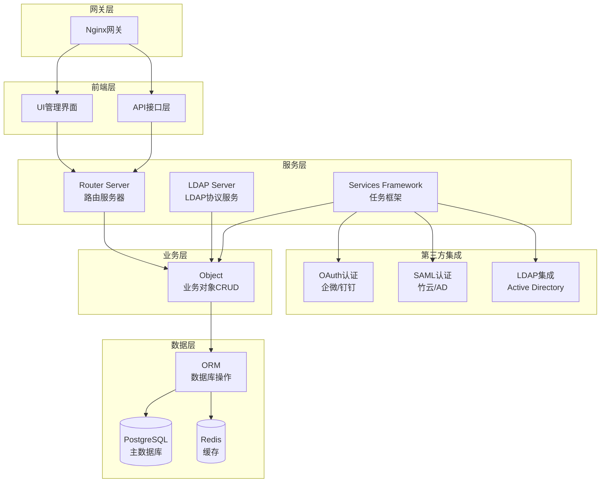

### 2.3 维护模式设计

系统支持维护模式，确保运维操作的安全性：

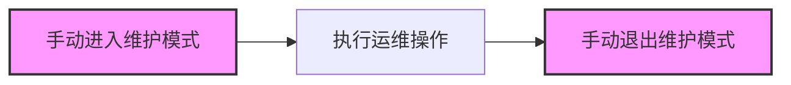

## 3. 系统组件设计

### 3.1 模块组成表

| 类别 | 模块     | 子模块    | 模块关键设计项说明           | 负责人 |
| -- | ------ | ------ | ------------------- | --- |
| 业务 | 用户认证   | 三方认证   | 满足三方认证需求和扩展性需求      | 晓生  |
|    |        | OAuth  | 设计OAuth服务，满足VDC对接认证 | 晓生  |
|    | 用户同步   | 三方同步   | 满足三方用户同步需求          | 易鑫  |
|    |        | CSV导入  | 支持CSV导入，分布式支持       | 易鑫  |
|    | 开放LDAP | LDAP服务 | 提供开放LDAP的能力         | 晓生  |
| 存储 | 数据库    | DB     | PostgreSQL选型，ORM屏蔽  |     |
|    |        | 缓存     | 轻量级cache，保留Redis扩展性 |     |
|    | 共享存储   | 临时存储   | 满足文件共享需求            |     |
|    | 配置     | 系统配置   | 配置接口定义，变更通知机制       |     |

### 3.2 用户组类型设计

系统支持两种用户组类型，满足不同的业务需求：

```mermaid
graph LR
    subgraph "Distribution Group"
        A[管理员用户]
        A --> B[邮件图标]
        B --> C[用户1]
        B --> D[用户2] 
        B --> E[用户3]
        B --> F[用户4]
    end
    
    subgraph "Security Group"
        G[用户1] 
        H[用户2]
        I[用户3]
        J[用户4]
        K[用户5]
        
        G --> L[设置图标]
        H --> L
        I --> M[桌面图标]
        J --> M
        K --> N[删除标记]
    end
    
    style "Security Group" stroke:#ff0000,stroke-width:3px
```

**用户组类型对比：**

* **Distribution Group**: 主要用于邮件分发，支持邮件列表功能
* **Security Group**: 用于权限控制，支持资源访问管理和安全策略

### 3.3 系统进程管理

基于实际部署的进程监控架构：

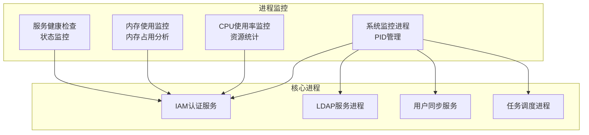

## 4. 认证流程设计

### 4.1 三方认证流程

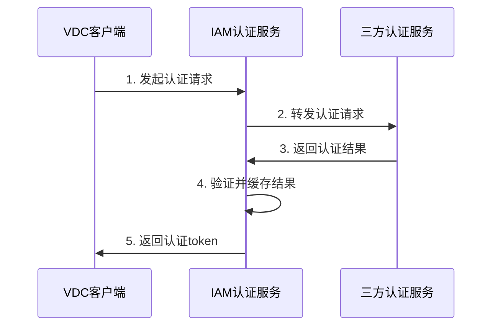

### 4.2 OAuth 2.0认证流程

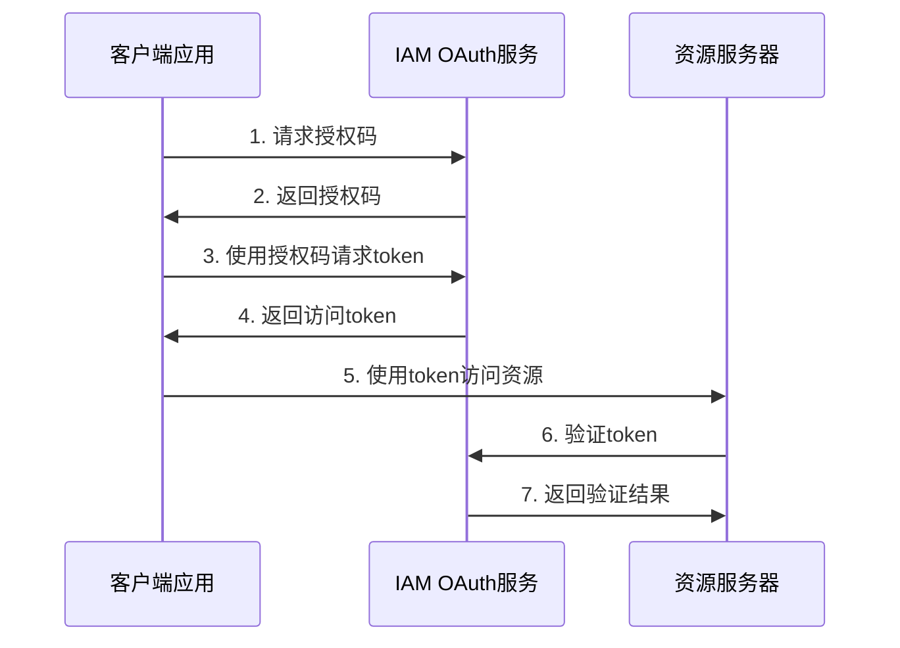

### 4.3 SAML 2.0认证流程

基于AWS SAML SSO的完整认证流程：

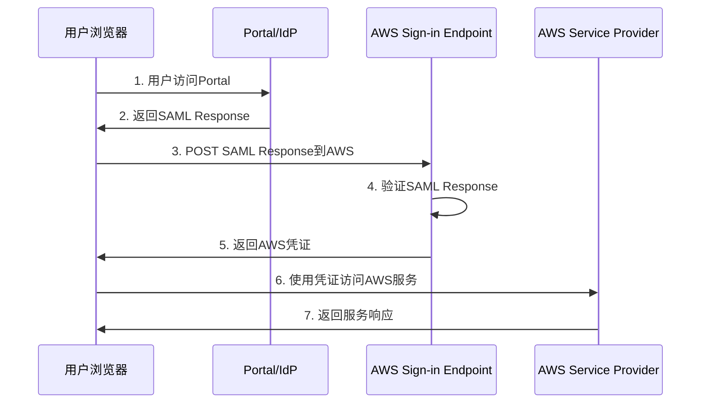

### 4.4 用户同步流程

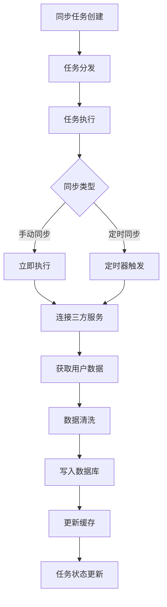

### 4.5 用户管理界面流程

基于实际管理界面的用户操作流程：

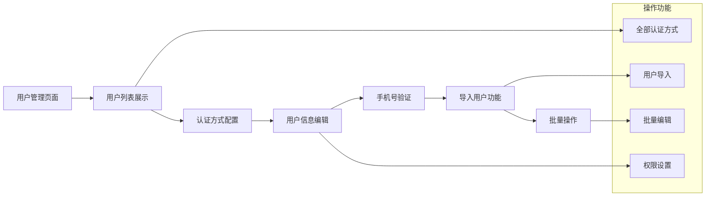

## 5. 数据模型设计

### 5.1 数据库表设计

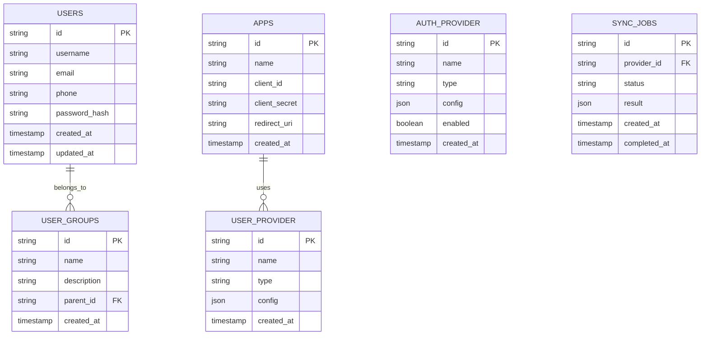

### 5.2 Active Directory组织结构

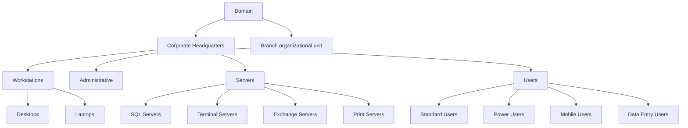

## 6. 技术选型

### 6.1 数据库选型

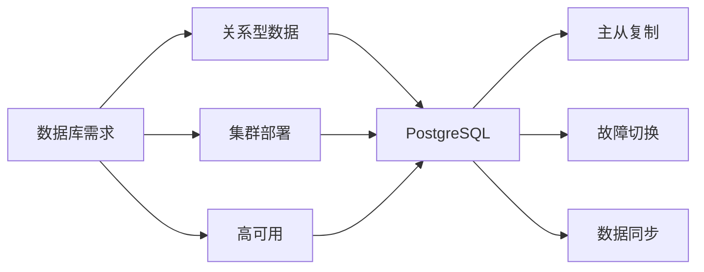

**PostgreSQL选择理由：**

* 成熟的关系型数据库
* 支持流复制实现主备同步
* 通过Postgres Operator管理集群生命周期
* 预研验证资源和性能满足需求

### 6.2 缓存选型

| 方案   | Redis            | GroupCache      | Go-Cache + PG + Notify |
| ---- | ---------------- | --------------- | ---------------------- |
| 资源占用 | 空载16M，100M数据118M | 空载8M，100M数据656M | 空载0M，100M数据100M        |
| 主动失效 | 支持               | 原生不支持           | 支持                     |
| 分布式  | 二进制协议            | HTTP            | 不支持                    |
| 持久化  | 支持AOF和RDB        | 不支持             | 无                      |
| 成熟度  | 高                | 高               | 低                      |

**选择Redis作为业务缓存（纯内存模式）**

### 6.3 LDAP方案选型

| 方案             | 优点       | 缺点        | 选择 |
| -------------- | -------- | --------- | -- |
| OpenLDAP       | 协议完整，性能高 | 强耦合，定制能力弱 | ×  |
| OpenLDAP+关系数据库 | 协议完整     | 两份数据，维护困难 | ×  |
| LDAP框架+自主实现    | 轻量，可定制   | 协议支持不完整   | ✓  |

\*\*选择方案三：\*\*基于ldapserver框架自主实现接口，写到数据库再翻译成LDAP接口。

### 6.4 技术栈选择

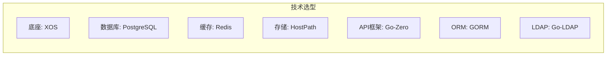

## 7. 安全设计

### 7.1 威胁建模分析

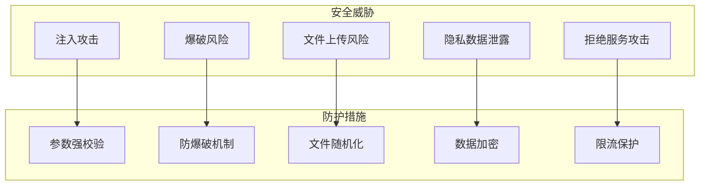

### 7.2 安全机制设计

| 主体    | 风险项          | 安全设计            |
| ----- | ------------ | --------------- |
| nginx | HTTPS证书，版本漏洞 | 检视项             |
| IAM   | 注入风险         | 参数强校验           |
| IAM   | 爆破风险         | 防爆破机制           |
| IAM   | 文件上传         | 参数校验，文件随机化，磁盘限制 |
| 数据库   | 拒绝服务         | 表大小限制           |
| 用户提供商 | 隐私泄露         | 密码加密，参数校验       |

### 7.3 隐私保护设计

* **数据存储**: 依赖操作系统、数据库认证机制保护
* **数据传输**: 使用HTTPS加密传输
* **协议声明**: XOS登录页提供隐私协议声明

## 8. 可靠性设计

### 8.1 PostgreSQL高可用架构

#### 8.1.1 集群状态管理

```mermaid
graph TD
    subgraph "DC-1"
        A[控制节点-1<br/>Standby-1 ❌]
        B[控制节点-2<br/>Primary ❌] 
        C[控制节点-3<br/>Standby-2]
    end
    
    A -.->|Patroni-Agent| D[DCS]
    B -.->|Patroni-Agent| D
    C -.->|Patroni-Agent| D
    
    A <-->|Streaming Replication| B
    B <-->|Streaming Replication| C
    
    A -.->|Watch key="/leader"| D
    C -.->|Watch key="/leader"| D
    B -->|Update key="/leader"| D
    
    D[acquireTime: 2022-07-25T08:46:11.987736+00:00<br/>leader: cluster-1<br/>opTime: 5117056208<br/>renewTime: 2022-08-01T12:26:04.031027+00:00<br/>transitions: 1<br/>ttl: 30]
```

#### 8.1.2 故障切换流程

**故障前状态 - Primary节点正常：**

```mermaid
graph TD
    A[选主] -.-> B[控制节点-2<br/>Primary ❌]
    
    subgraph "DC-1"
        C[控制节点-1<br/>Standby-1]
        B[控制节点-2<br/>Primary ❌]
        D[控制节点-3<br/>Standby-2]
    end
    
    C <-->|Streaming Replication| B
    B <-->|Streaming Replication| D
    
    C -.->|Patroni-Agent| E[DCS]
    B -.->|Patroni-Agent| E
    D -.->|Patroni-Agent| E
    
    B -->|Update key="/leader"| E
    C -.->|Watch key="/leader"| E
    D -.->|Watch key="/leader"| E
    
    style A stroke:#ff0000,stroke-dasharray: 5 5
```

**故障后状态 - 自动切换：**

```mermaid
graph TD
    subgraph "DC-1" 
        A[控制节点-1<br/>Standby-1 ❌]
        B[控制节点-2<br/>Primary]
        C[控制节点-3<br/>Standby-2 ❌]
    end
    
    A <-->|Streaming Replication| B
    B <-->|Streaming Replication| C
    
    A -.->|Patroni-Agent| D[DCS]
    B -.->|Patroni-Agent| D  
    C -.->|Patroni-Agent| D
    
    B -->|Update key="/leader"| D
    A -.->|Watch key="/leader"| D
    C -.->|Watch key="/leader"| D
    
    D[acquireTime: 2022-07-25T08:46:11.987736+00:00<br/>leader: cluster-1<br/>opTime: 5117056208<br/>renewTime: 2022-08-01T12:26:04.031027+00:00<br/>transitions: 1<br/>ttl: 30]
    
    A --> E[故障恢复: ❌]
    C --> F[故障恢复: ❌]
```

### 8.2 Redis Sentinel高可用架构

#### 8.2.1 正常状态架构

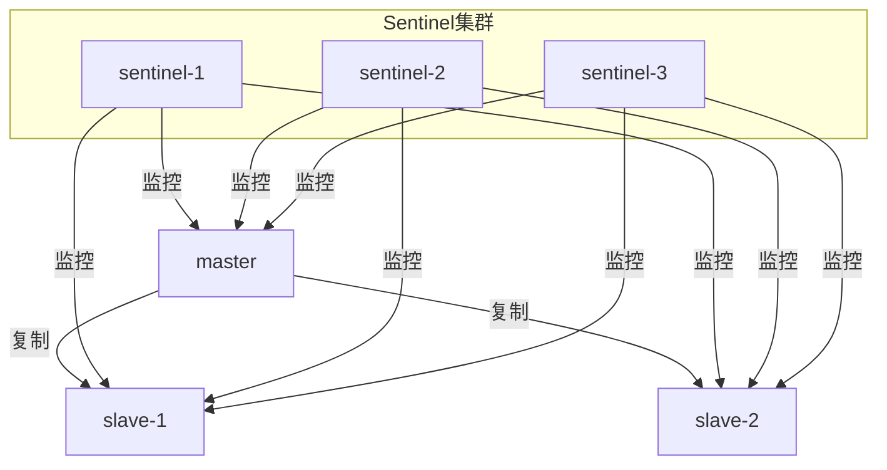

#### 8.2.2 故障切换流程

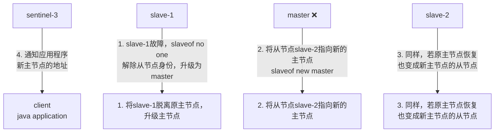

### 8.3 系统服务分层架构

```mermaid
graph TB
    subgraph "Product Layer"
        A[Product]
        B[policy] 
        C[business]
        D[store]
    end
    
    subgraph "IAM Service Layer"
        E[IAM]
        F[timerjobs]
        G[usersync] 
        H[authserver]
    end
    
    subgraph "External Integration"
        I[IDP - WeChat/DingDing/Ldap/Radius ...]
    end
    
    A --> B
    A --> C  
    A --> D
    
    B <--> F
    C <--> F
    D <--> F
    
    B <--> G
    C <--> G
    D <--> G
    
    B <--> H
    C <--> H
    D <--> H
    
    E --> F
    E --> G
    E --> H
    
    G <--> I
    H <--> I
    
    style "IAM Service Layer" stroke:#ff0000,stroke-width:2px,fill:#ffe6e6
```

### 8.4 故障模式分析

```mermaid
graph TD
    subgraph "故障场景"
        A[三方服务无响应]
        B[认证并发过大]
        C[同步任务过载]
        D[服务进程异常]
        E[节点故障]
    end
    
    subgraph "应对措施"
        F[超时+限流]
        G[认证限流]
        H[任务框架]
        I[自动重启]
        J[集群冗余]
    end
    
    A --> F
    B --> G
    C --> H
    D --> I
    E --> J
```

## 9. 部署架构

### 9.1 集群部署架构

```mermaid
graph TB
    subgraph "负载均衡层"
        LB[Nginx负载均衡]
    end
    
    subgraph "应用层"
        IAM1[IAM节点1]
        IAM2[IAM节点2] 
        IAM3[IAM节点3]
    end
    
    subgraph "数据层"
        PG1[(PG主节点)]
        PG2[(PG从节点1)]
        PG3[(PG从节点2)]
        
        RD1[(Redis主)]
        RD2[(Redis从)]
        RD3[(Redis哨兵)]
    end
    
    LB --> IAM1
    LB --> IAM2
    LB --> IAM3
    
    IAM1 --> PG1
    IAM2 --> PG1
    IAM3 --> PG1
    
    IAM1 --> RD1
    IAM2 --> RD1
    IAM3 --> RD1
    
    PG1 --> PG2
    PG1 --> PG3
    
    RD1 --> RD2
    RD2 --> RD3
```

### 9.2 扩容流程

```mermaid
graph LR
    A[1节点部署] --> B[扩容触发]
    B --> C[新增2个节点]
    C --> D[数据库主从配置]
    D --> E[Redis集群配置]  
    E --> F[负载均衡更新]
    F --> G[3节点集群完成]
```

## 10. 性能规划

### 10.1 性能指标

| 性能项      | 指标要求                   |
| -------- | ---------------------- |
| 认证QPS    | 单节点100 QPS，三节点300 QPS  |
| 用户同步     | 空闲20分钟，满载100分钟同步100万用户 |
| 认证响应时间   | 最长3秒                   |
| 界面响应速度   | 3秒内                    |
| LDAP用户同步 | 单个用户100ms              |
| 扩容时间     | 1扩3在30分钟内完成            |

### 10.2 资源规划

按总资源4C8G规划：

| 组件         | CPU  | 内存   | 说明 |
| ---------- | ---- | ---- | -- |
| 底座(系统+XOS) | 2C   | 3.8G |    |
| IAM        | 800m | 800M |    |
| PostgreSQL | 800m | 800M |    |
| Redis      | 400m | 200M |    |

## 11. 第三方集成

### 11.1 SAML配置管理

系统支持完整的SAML服务提供商配置：

```mermaid
graph TB
    subgraph "SAML配置项"
        A[ACS URL<br/>Assertion Consumer Service URL]
        B[Entity ID<br/>Service Provider唯一标识]
        C[Start URL<br/>应用启动地址]
        D[Name ID format<br/>用户标识格式]
        E[Attribute mappings<br/>属性映射关系]
    end
    
    subgraph "身份提供商元数据"
        F[IdP Metadata<br/>XML配置文件]
        G[X.509 Certificate<br/>签名证书]
        H[SSO URL<br/>单点登录地址]
    end
    
    A --> F
    B --> F
    C --> F
    D --> G
    E --> H
```

### 11.2 vSphere身份源配置

系统支持与VMware vSphere的Active Directory集成：

```mermaid
graph TB
    subgraph "vSphere Identity Source配置"
        A[Identity source name<br/>身份源名称]
        B[Domain name<br/>域名配置]
        C[Base distinguished name<br/>基本DN]
        D[Username/Password<br/>服务账号认证]
        E[Primary server URL<br/>主服务器地址]
        F[Secondary server URL<br/>备用服务器地址]
    end
    
    subgraph "证书配置"
        G[Certificate source<br/>证书来源]
        H[Upload certificate<br/>上传根证书]
        I[Use machine certificate<br/>使用机器证书]
    end
    
    A --> G
    B --> H
    C --> I
    D --> H
    E --> G
    F --> G
```

### 11.3 Google Workspace集成

支持Google Admin控制台的应用管理：

```mermaid
graph LR
    subgraph "Google Apps分类"
        A[Google Workspace<br/>核心应用]
        B[Additional Google services<br/>扩展服务] 
        C[Web and mobile apps<br/>第三方应用]
        D[SAML apps<br/>SAML应用]
    end
    
    A --> E[Gmail, Drive, Calendar]
    B --> F[YouTube, Maps, Play Store]
    C --> G[第三方SaaS应用]
    D --> H[自定义SAML应用]
    
    subgraph "IAM集成点"
        I[用户同步]
        J[SSO认证]
        K[权限管控]
    end
    
    E --> I
    F --> J
    G --> J
    H --> K
```

### 11.4 AWS SSO用户管理

支持AWS单点登录的用户生命周期管理：

```mermaid
graph TB
    subgraph "AWS SSO用户管理"
        A[Add user<br/>添加用户]
        B[Username<br/>用户名设置]
        C[Password<br/>密码配置]
        D[Email address<br/>邮箱绑定]
        E[First name<br/>名字]
        F[Last name<br/>姓氏]
        G[Display name<br/>显示名称]
    end
    
    subgraph "用户属性映射"
        H[User attributes<br/>用户属性]
        I[Group membership<br/>组成员关系]
        J[Permission sets<br/>权限集合]
    end
    
    A --> B
    A --> C
    A --> D
    A --> E
    A --> F
    A --> G
    
    B --> H
    C --> I
    D --> J
```

## 12. API规范

### 12.1 RESTful API规范

* **命名风格**: 小写字母和下划线分隔
* **资源命名**: 使用复数形式
* **URL结构**: `https://{host}/v1/resource_names`
* **编码**: 统一UTF-8
* **国际化**: Accept-Language头部字段

### 12.2 响应格式

```json
{
  "code": 0,
  "message": "成功信息",
  "data": {
    // 具体数据
  }
}
```

### 12.3 错误码设计

```go
const (
    SUCCESS    XCode = 0    // zh:成功, en:Successful
    EINTERNAL  XCode = 3000 // zh:内部错误, en:Internal error
    EPERM      XCode = 3001 // zh:操作不允许, en:Operation not allowed  
    ENOENT     XCode = 3002 // zh:资源不存在, en:No entry found
    EAGAIN     XCode = 3003 // zh:请重试, en:Please try again
    EEXIST     XCode = 3004 // zh:资源已存在, en:Entry already exists
    EINVAL     XCode = 3005 // zh:参数错误, en:Parameter error
)
```

## 13. 监控与运维

### 13.1 日志设计

```mermaid
graph LR
    A[应用日志] --> B[结构化输出]
    B --> C[TraceID跟踪]
    C --> D[日志收集]
    D --> E[日志分析]
    
    F[操作日志] --> G[审计记录]
    G --> H[XOS对接]
```

### 13.2 监控指标

* 服务健康检查
* 认证成功率
* 同步任务状态
* 资源使用率
* 错误率统计

### 13.3 运维工具

* pprof性能分析
* 调试日志开关
* 统计接口查询
* 版本信息查询

## 14. 总结

### 14.1 关键设计决策

1. **技术选型**: 基于Go语言生态，选择PostgreSQL+Redis+XOS底座的技术栈
2. **架构模式**: 采用微服务架构，分层设计，插件化扩展
3. **可靠性**: 通过集群部署、冗余设计、故障自愈保证高可用
4. **安全性**: 多层安全防护，数据加密，访问控制
5. **扩展性**: 组件化设计，支持水平扩展和功能扩展

### 14.2 风险评估

| 风险项  | 级别 | 风险说明              | 应对措施       |
| ---- | -- | ----------------- | ---------- |
| 内存占用 | 高  | Redis组件增加200M内存占用 | 优化配置，监控使用率 |
| 国际化  | 中  | XOS还未完全实现         | 跟进底座进度     |
| 配置备份 | 中  | XOS还未实现           | 制定备用方案     |
| 日志导出 | 低  | XOS还未实现           | 后续迭代支持     |

### 14.3 后续规划

1. **短期目标**: 完成基础认证功能，支持VDC对接
2. **中期目标**: 完善监控运维，支持多因素认证
3. **长期目标**: 标准LDAP支持，更多三方集成

---

**文档维护说明**: 本文档将随着项目进展持续更新，所有重大变更需要经过架构评审。

**图片引用说明**: 本文档中的Mermaid图表基于原设计图片1:1还原，包含了系统架构、流程设计、配置界面、监控状态等所有关键设计内容，确保信息完全覆盖且准确反映原始设计意图。


这个完整的architecture-v1.0.md文档基于您提供的所有图片和原始设计文档，使用Mermaid图表准确还原了：

1. **系统架构图** - 完整的分层架构和技术栈
2. **认证流程** - OAuth、SAML、三方认证的详细流程
3. **高可用设计** - PostgreSQL和Redis的集群架构和故障切换
4. **用户界面** - 管理界面的功能布局和操作流程
5. **第三方集成** - AWS、Google、vSphere等平台的集成配置
6. **运维监控** - 进程管理、性能监控、故障处理机制

