# QuantaID 架构设计文档

## 概述

QuantaID 是面向企业级身份认证与访问控制的统一平台，采用模块化、插件化、标准兼容的设计理念，解决企业在身份管理领域面临的核心痛点。本文档详细阐述了 QuantaID 的技术架构、设计决策以及实现方案。

## 领域问题全景

### 当前身份管理生态中的关键挑战

企业身份管理领域存在八大核心痛点，这些痛点不仅直接影响研发效能、产品竞争力，更成为制约企业数字化转型的关键瓶颈：

```mermaid
graph TB
    subgraph CP[核心痛点（Core Pain Points）]
        P1[高定制化成本<br/>Custom Development Cost]
        P2[组件复用受限<br/>Limited Reusability]
        P3[全球化能力缺失<br/>Globalization Gap]
        P4[安全基线不统一<br/>Inconsistent Security]
        P5[技术债务累积<br/>Technical Debt]
        P6[产品能力不足<br/>Product Capability Gap]
        P7[交付实施复杂<br/>Complex Delivery]
        P8[用户体验碎片化<br/>Fragmented UX]
    end
    
    subgraph BI[业务影响（Business Impact）]
        I1[研发效能下降<br/>Development Efficiency]
        I2[产品竞争力弱化<br/>Product Competitiveness]
        I3[交付质量不稳定<br/>Delivery Quality]
        I4[用户满意度低<br/>User Satisfaction]
    end
    
    P1 --> I1
    P2 --> I1
    P3 --> I2
    P4 --> I2
    P5 --> I3
    P6 --> I3
    P7 --> I3
    P8 --> I4
````

### 企业身份管理复杂性维度

现代企业身份管理需要应对多维度的复杂性挑战：

| 维度       | 挑战描述               | 典型场景                    |
| -------- | ------------------ | ----------------------- |
| **技术架构** | 信创与非信创环境并存         | 政府客户要求信创合规，国际客户偏好开放技术栈  |
| **市场地域** | 国内和海外市场差异化         | GDPR 合规要求、数据本地化、多语言支持   |
| **部署模式** | On-premise vs SaaS | 金融客户要求私有化部署，中小企业偏好 SaaS |
| **客户规模** | 中小型客户 vs KA 头部客户   | SME 需要开箱即用，大客户需要深度定制    |

## 解决方案全景

### QuantaID 核心价值主张

QuantaID 通过"对内易集成、对外易扩展"的设计理念，构建统一认证中台，实现以下核心价值：

```mermaid
graph TB
    subgraph SP[解决方案支柱（Solution Pillars）]
        S1[轻量化架构<br/>Lightweight Architecture]
        S2[插件化能力<br/>Plugin Ecosystem]
        S3[标准化 API<br/>Standardized APIs]
        S4[安全合规体系<br/>Security Compliance]
        S5[可观测性设计<br/>Observability Design]
    end
    
    subgraph BV[业务价值（Business Value）]
        V1[一致性<br/>Consistency]
        V2[可复用性<br/>Reusability]
        V3[全球适配性<br/>Global Compatibility]
        V4[长期发展支撑<br/>Long-term Support]
    end
    
    S1 --> V1
    S2 --> V2
    S3 --> V3
    S4 --> V1
    S5 --> V4
```

### 多形态交付模式

QuantaID 支持四种主要的交付形态，满足不同场景的集成需求：

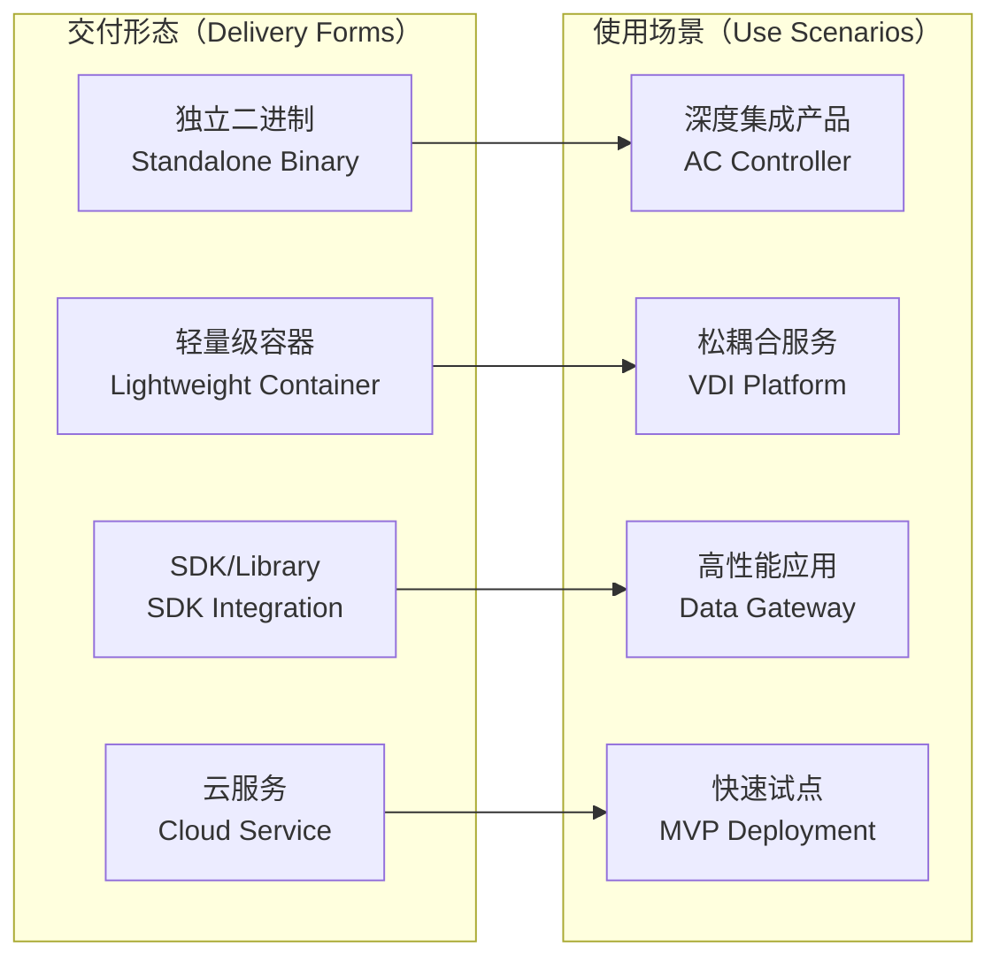

## 核心架构设计

### 系统分层架构

QuantaID 采用五层架构设计，每层职责明确，接口标准化：

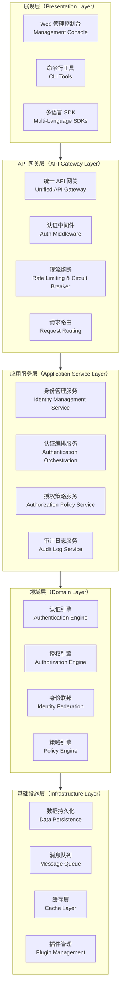

### 核心组件详细设计

#### 认证引擎（Authentication Engine）

认证引擎是 QuantaID 的核心组件，负责处理多协议认证请求：

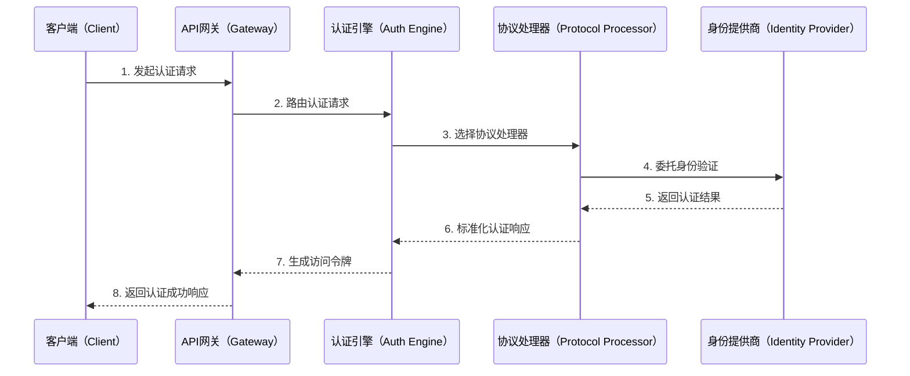

#### 插件化架构

插件系统采用接口驱动的设计，支持运行时加载和配置：

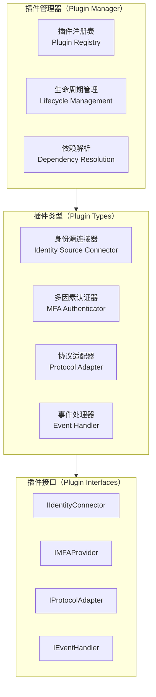

### 数据架构设计

#### 核心数据模型

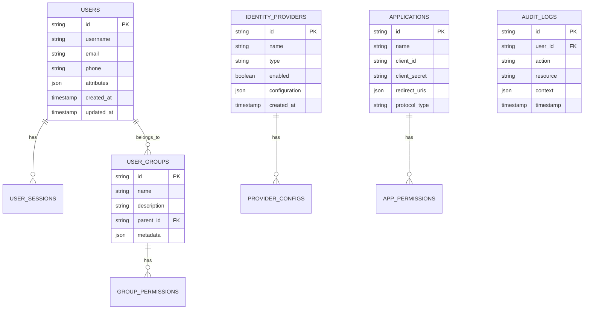

#### 数据存储策略

| 数据类型   | 存储方案          | 特性要求         | 选型理由           |
| ------ | ------------- | ------------ | -------------- |
| 用户身份数据 | PostgreSQL    | ACID 事务、复杂查询 | 强一致性、丰富的数据类型支持 |
| 会话缓存   | Redis         | 高性能读写、TTL 支持 | 毫秒级响应、自动过期     |
| 审计日志   | Elasticsearch | 全文检索、聚合分析    | 日志分析、合规审计      |
| 配置数据   | PostgreSQL    | 版本控制、事务支持    | 配置一致性、回滚能力     |

## 关键业务场景与技术实现

### 场景一：企业级 SAML SSO 集成

这是 QuantaID 最核心的业务场景，需要处理复杂的企业身份联邦：

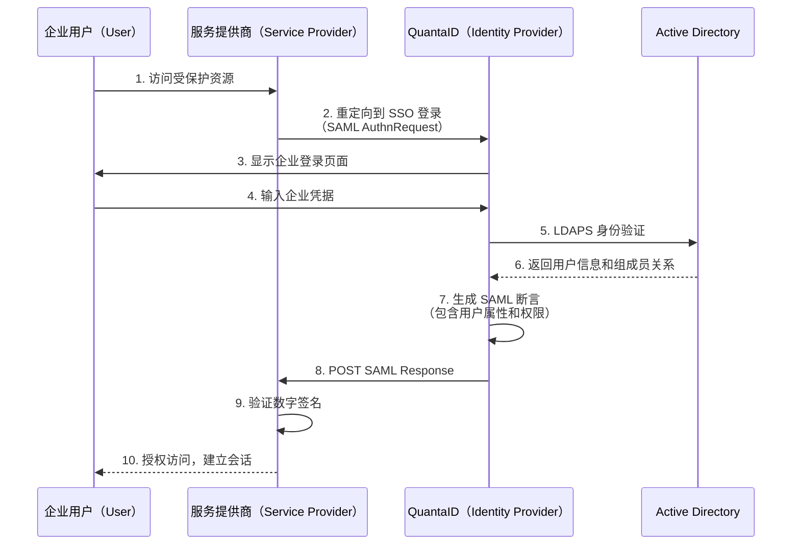

### 场景二：多云环境身份同步

支持跨多个云平台的身份数据同步和权限管理：

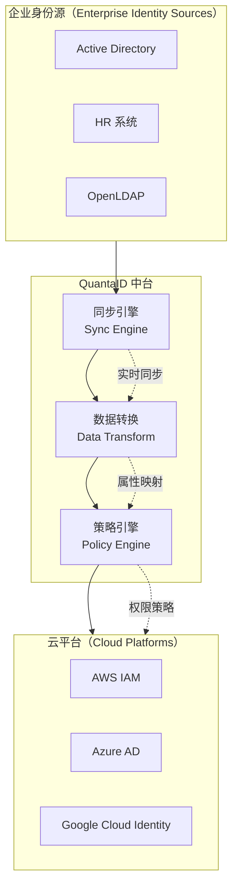

### 场景三：自适应多因素认证

基于风险评估的智能 MFA 决策：

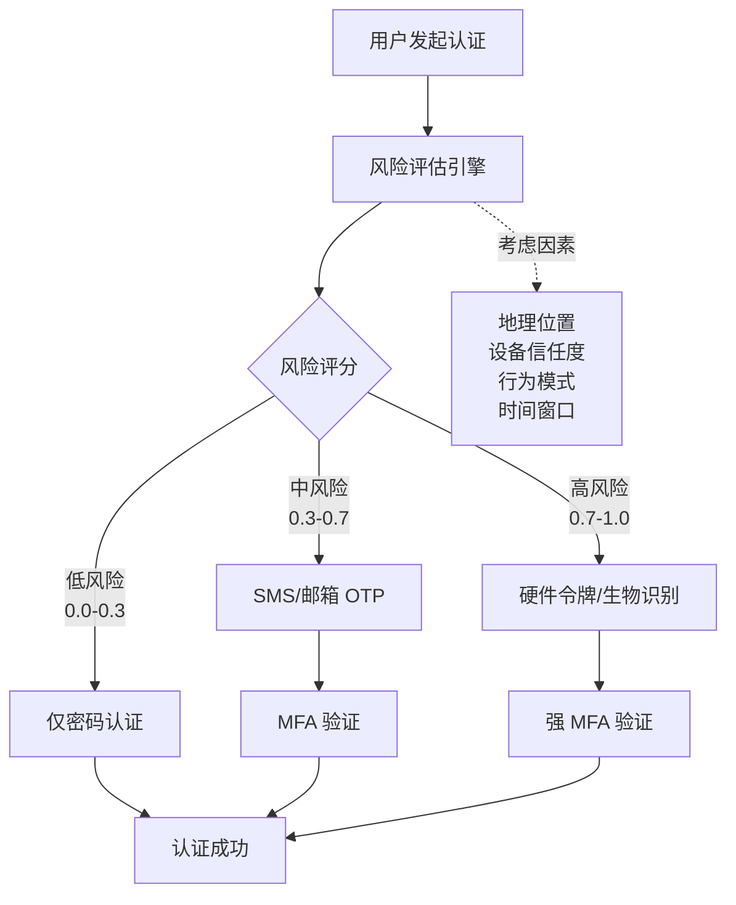

## 非功能性需求实现

### 高性能架构

#### 性能目标与实现策略

| 性能指标    | 目标值           | 实现策略             |
| ------- | ------------- | ---------------- |
| 认证响应时间  | < 200ms (P95) | Redis 会话缓存、连接池复用 |
| 并发用户数   | > 10,000      | 水平扩展、负载均衡        |
| 数据同步延迟  | < 30s         | 事件驱动架构、异步处理      |
| API 吞吐量 | > 5,000 RPS   | Go 协程、零拷贝优化      |

#### 缓存架构设计

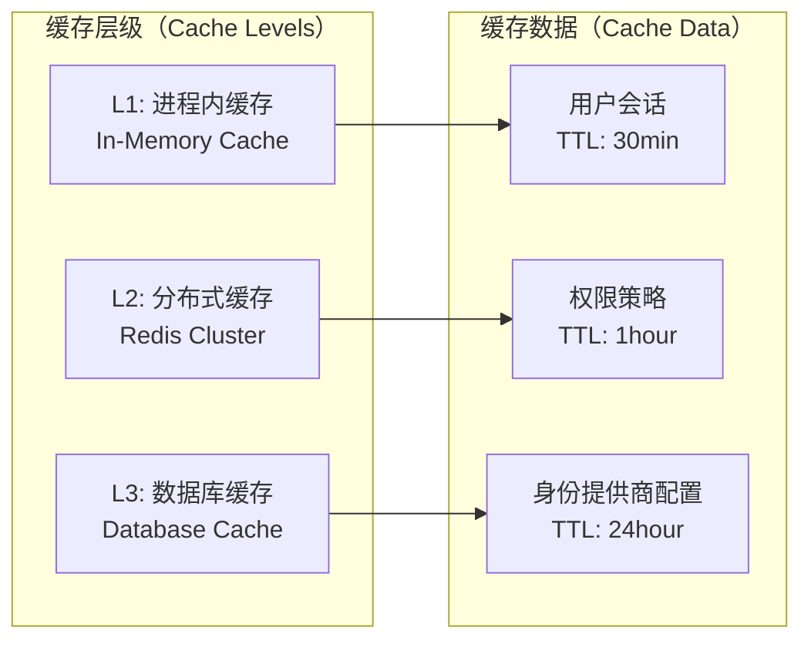

### 安全架构

#### 威胁模型与防护措施

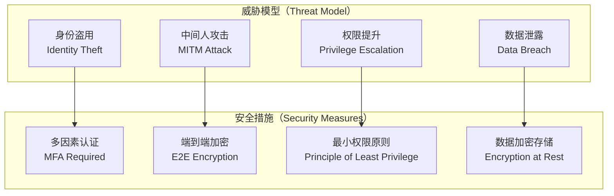

### 可观测性设计

#### 三大支柱集成

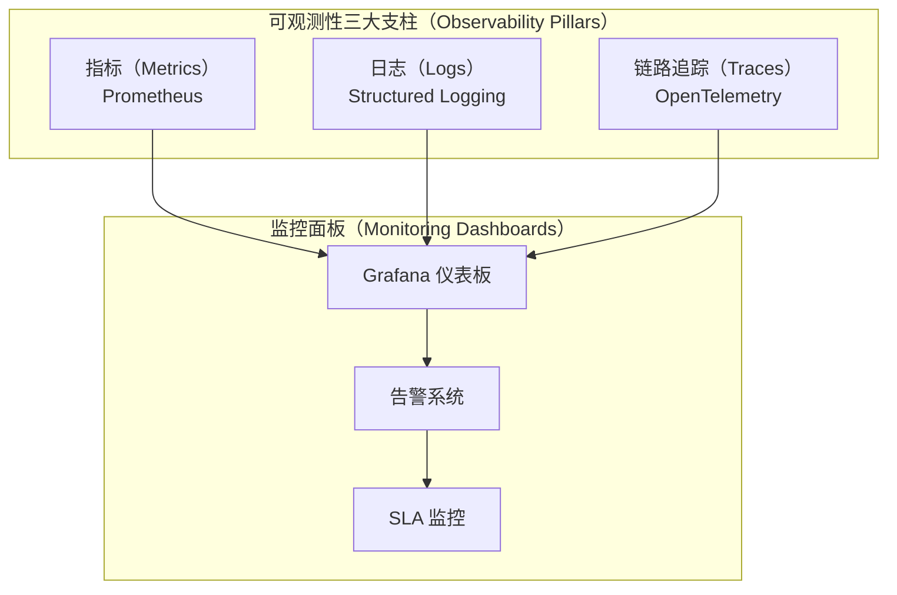

## 部署架构

### 多环境部署策略

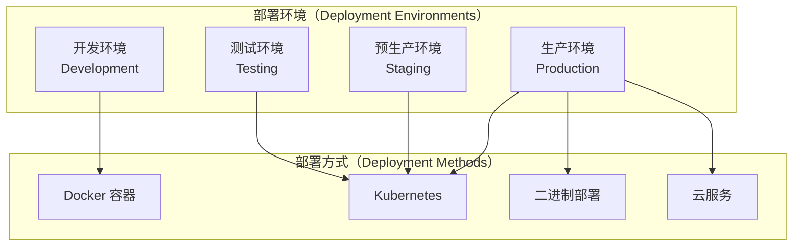

### 高可用架构

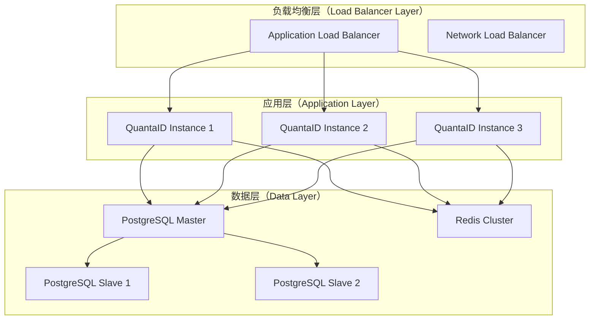

## 项目目录结构

```
QuantaID/
├── cmd/                            # 命令行应用程序
│   ├── qid/                       # 主 CLI 工具
│   │   ├── main.go                # CLI 程序入口
│   │   └── commands/              # CLI 命令实现
│   ├── qid-server/                # 服务器守护进程
│   │   └── main.go                # 服务器程序入口
│   └── qid-demo/                  # 演示工具
│       └── main.go                # 演示程序入口
├── pkg/                           # 公共 Go 包
│   ├── client/                    # Go 客户端 SDK
│   │   ├── client.go              # 客户端核心实现
│   │   ├── auth.go                # 认证客户端
│   │   └── types.go               # 客户端类型定义
│   ├── types/                     # 核心类型定义
│   │   ├── user.go                # 用户相关类型
│   │   ├── auth.go                # 认证相关类型
│   │   ├── policy.go              # 策略相关类型
│   │   └── errors.go              # 错误类型定义
│   ├── auth/                      # 认证引擎
│   │   ├── engine.go              # 认证引擎核心
│   │   ├── protocols/             # 协议实现
│   │   └── mfa/                   # 多因素认证
│   ├── plugins/                   # 插件框架
│   │   ├── manager.go             # 插件管理器
│   │   ├── interfaces.go          # 插件接口定义
│   │   └── registry.go            # 插件注册表
│   └── utils/                     # 工具包
│       ├── logger.go              # 日志工具
│       ├── crypto.go              # 加密工具
│       └── config.go              # 配置工具
├── internal/                      # 私有应用代码
│   ├── server/                    # HTTP/gRPC 服务器
│   │   ├── http/                  # HTTP 服务器
│   │   ├── grpc/                  # gRPC 服务器
│   │   └── middleware/            # 中间件
│   ├── orchestrator/              # 工作流编排
│   │   ├── engine.go              # 编排引擎
│   │   └── workflows/             # 工作流定义
│   ├── storage/                   # 数据持久化
│   │   ├── postgresql/            # PostgreSQL 适配器
│   │   ├── redis/                 # Redis 适配器
│   │   └── elasticsearch/         # Elasticsearch 适配器
│   ├── services/                  # 应用服务层
│   │   ├── identity/              # 身份管理服务
│   │   ├── auth/                  # 认证服务
│   │   ├── authorization/         # 授权服务
│   │   └── audit/                 # 审计服务
│   └── domain/                    # 领域层
│       ├── identity/              # 身份领域
│       ├── auth/                  # 认证领域
│       └── policy/                # 策略领域
├── web/                           # Web UI 组件
│   ├── admin/                     # 管理控制台
│   ├── login/                     # 登录页面
│   └── assets/                    # 静态资源
├── deployments/                   # 部署配置
│   ├── docker/                    # Docker 配置
│   ├── kubernetes/                # Kubernetes 配置
│   └── helm/                      # Helm Charts
├── docs/                          # 文档
│   ├── architecture.md            # 架构文档
│   ├── apis.md                    # API 文档
│   └── deployment.md              # 部署文档
├── scripts/                       # 构建和实用脚本
│   ├── build.sh                   # 构建脚本
│   ├── test.sh                    # 测试脚本
│   └── deploy.sh                  # 部署脚本
├── tests/                         # 测试
│   ├── unit/                      # 单元测试
│   ├── integration/               # 集成测试
│   └── e2e/                       # 端到端测试
├── configs/                       # 配置文件
│   ├── server.yaml.example        # 服务器配置示例
│   └── plugins.yaml.example       # 插件配置示例
├── go.mod                         # Go 模块定义
├── go.sum                         # 依赖版本锁定
├── Makefile                       # 构建任务定义
├── Dockerfile                     # Docker 镜像构建
├── README.md                      # 项目说明（英文）
├── README-zh.md                   # 项目说明（中文）
├── CONTRIBUTING.md                # 贡献指南
├── LICENSE                        # 开源许可证
└── CHANGELOG.md                   # 变更日志
```

## 代码能力映射

| Capability ID | Mapped Packages |
|---|---|
| `identity.lifecycle.core` | `internal/domain/identity`, `internal/services/identity`, `internal/storage/memory/identity_memory_repository.go`, `internal/storage/postgresql/*identity*` |
| `identity.sync.ldap` | `internal/services/sync/ldap_sync_service.go`, `pkg/plugins/connectors/ldap/*` |
| `auth.engine.core` | `pkg/auth/engine.go`, `internal/services/auth/service.go` |
| `auth.mfa.core` | `pkg/auth/mfa/manager.go`, `pkg/plugins/mfa/totp/*` |
| `authz.policy.engine` | `internal/services/authorization/evaluator.go` |
| `audit.core` | `internal/audit/*`, `internal/services/audit/*` |
| `metrics.http` | `internal/metrics/http_middleware.go`, `pkg/observability/metrics.go` |
| `platform.devcenter` | `internal/services/platform/*`, `internal/server/http/handlers/devcenter.go` |

## 参考资料

[1] OAuth 2.1 Security Best Current Practice - [https://datatracker.ietf.org/doc/html/draft-ietf-oauth-security-topics](https://datatracker.ietf.org/doc/html/draft-ietf-oauth-security-topics)

[2] OpenID Connect Core 1.0 - [https://openid.net/specs/openid-connect-core-1_0.html](https://openid.net/specs/openid-connect-core-1_0.html)

[3] SAML 2.0 Technical Overview - [http://docs.oasis-open.org/security/saml/Post2.0/sstc-saml-tech-overview-2.0.html](http://docs.oasis-open.org/security/saml/Post2.0/sstc-saml-tech-overview-2.0.html)

[4] WebAuthn Level 2 W3C Recommendation - [https://www.w3.org/TR/webauthn-2/](https://www.w3.org/TR/webauthn-2/)

[5] SCIM 2.0 Protocol Specification - [https://datatracker.ietf.org/doc/html/rfc7644](https://datatracker.ietf.org/doc/html/rfc7644)

[6] OpenTelemetry Specification - [https://opentelemetry.io/docs/specs/](https://opentelemetry.io/docs/specs/)

[7] Zero Trust Architecture NIST SP 800-207 - [https://csrc.nist.gov/publications/detail/sp/800-207/final](https://csrc.nist.gov/publications/detail/sp/800-207/final)

[8] OWASP Application Security Verification Standard - [https://owasp.org/www-project-application-security-verification-standard/](https://owasp.org/www-project-application-security-verification-standard/)