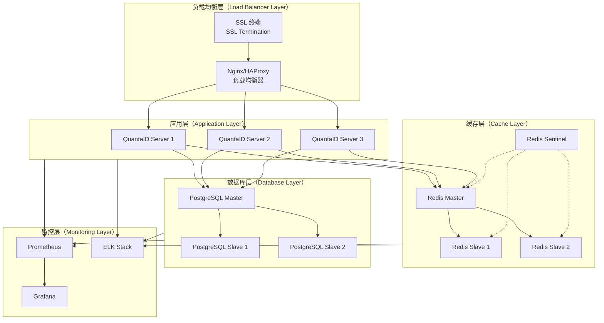

# QuantaID 部署指南

## 概述

本指南详细描述了 QuantaID 在各种环境中的部署方法，包括开发、测试、预生产和生产环境的最佳实践。

## 部署架构选择

### 部署形态对比

```mermaid
graph TB
    subgraph DF[部署形态（Deployment Forms）]
        SA[独立部署<br/>Standalone]
        CT[容器化部署<br/>Containerized]
        K8S[Kubernetes<br/>云原生]
        SAAS[SaaS 服务<br/>Cloud Service]
    end
    
    subgraph SC[适用场景（Suitable Scenarios）]
        SC1[开发测试<br/>简单快速部署]
        SC2[生产环境<br/>标准化部署]
        SC3[大规模部署<br/>弹性扩展]
        SC4[快速接入<br/>零运维成本]
    end
    
    SA --> SC1
    CT --> SC2
    K8S --> SC3
    SAAS --> SC4
````

| 部署形态       | 适用场景      | 优势         | 考虑因素       |
| ---------- | --------- | ---------- | ---------- |
| 独立二进制      | 开发测试、边缘计算 | 部署简单、资源占用小 | 手动管理、扩展性有限 |
| Docker 容器  | 标准化生产环境   | 环境一致性、易于管理 | 需要容器平台支持   |
| Kubernetes | 大规模云原生环境  | 自动扩展、高可用   | 复杂度高、学习成本  |
| SaaS 服务    | 快速试点、中小企业 | 零运维、快速上线   | 数据隐私、定制限制  |

## 系统要求

### 最低配置要求

| 组件              | CPU  | 内存  | 存储        | 网络      |
| --------------- | ---- | --- | --------- | ------- |
| QuantaID Server | 2 核心 | 4GB | 50GB SSD  | 100Mbps |
| PostgreSQL      | 2 核心 | 4GB | 100GB SSD | -       |
| Redis           | 1 核心 | 2GB | 10GB SSD  | -       |
| Load Balancer   | 1 核心 | 1GB | 10GB      | 1Gbps   |

### 生产环境推荐配置

| 组件                   | CPU  | 内存   | 存储        | 说明      |
| -------------------- | ---- | ---- | --------- | ------- |
| QuantaID Server (×3) | 4 核心 | 8GB  | 100GB SSD | 集群部署高可用 |
| PostgreSQL 主库        | 8 核心 | 32GB | 500GB SSD | 高性能 SSD |
| PostgreSQL 从库 (×2)   | 4 核心 | 16GB | 500GB SSD | 读写分离    |
| Redis 集群 (×3)        | 2 核心 | 8GB  | 50GB SSD  | 缓存集群    |
| Elasticsearch (×3)   | 4 核心 | 16GB | 200GB SSD | 日志分析    |

## 环境准备

### 操作系统支持

```bash
# CentOS/RHEL 系统准备
sudo yum update -y
sudo yum install -y wget curl unzip

# Ubuntu/Debian 系统准备  
sudo apt update
sudo apt install -y wget curl unzip

# 创建系统用户
sudo useradd -r -s /bin/false quantaid
sudo mkdir -p /opt/quantaid/{bin,config,logs,data}
sudo chown -R quantaid:quantaid /opt/quantaid
```

### 网络配置

```bash
# 防火墙规则配置
sudo firewall-cmd --permanent --add-port=8080/tcp  # HTTP API
sudo firewall-cmd --permanent --add-port=8443/tcp  # HTTPS API  
sudo firewall-cmd --permanent --add-port=9090/tcp  # 监控端口
sudo firewall-cmd --reload

# 或使用 iptables
sudo iptables -A INPUT -p tcp --dport 8080 -j ACCEPT
sudo iptables -A INPUT -p tcp --dport 8443 -j ACCEPT
sudo iptables -A INPUT -p tcp --dport 9090 -j ACCEPT
```

## 独立部署

### 二进制部署

```bash
# 下载 QuantaID 二进制文件
wget https://github.com/turtacn/QuantaID/releases/latest/download/quantaid-linux-amd64.tar.gz
tar -xzf quantaid-linux-amd64.tar.gz
sudo mv quantaid-linux-amd64/* /opt/quantaid/bin/

# 创建配置文件
cat > /opt/quantaid/config/server.yaml << 'EOF'
# QuantaID 服务器配置
server:
  host: 0.0.0.0
  port: 8080
  tls:
    enabled: false
    cert_file: ""
    key_file: ""

database:
  driver: postgres
  host: localhost
  port: 5432
  database: quantaid
  username: quantaid
  password: "your-secure-password"
  max_connections: 20
  ssl_mode: prefer

redis:
  host: localhost
  port: 6379
  password: ""
  database: 0
  pool_size: 10

logging:
  level: info
  format: json
  output: /opt/quantaid/logs/server.log
  rotation:
    max_size: 100
    max_files: 30

plugins:
  directory: /opt/quantaid/plugins
  auto_load: true

security:
  jwt_secret: "your-jwt-secret-key-at-least-256-bits"
  session_timeout: 3600
  max_login_attempts: 5
  lockout_duration: 900
EOF

# 创建系统服务
cat > /etc/systemd/system/quantaid.service << 'EOF'
[Unit]
Description=QuantaID Identity Management Service
After=network.target postgresql.service redis.service

[Service]
Type=simple
User=quantaid
Group=quantaid
ExecStart=/opt/quantaid/bin/qid-server --config /opt/quantaid/config/server.yaml
ExecReload=/bin/kill -HUP $MAINPID
Restart=always
RestartSec=10
StandardOutput=journal
StandardError=journal
SyslogIdentifier=quantaid

# 安全设置
NoNewPrivileges=true
ProtectSystem=strict
ProtectHome=true
ReadWritePaths=/opt/quantaid

[Install]
WantedBy=multi-user.target
EOF

# 启动服务
sudo systemctl daemon-reload
sudo systemctl enable quantaid
sudo systemctl start quantaid

# 检查服务状态
sudo systemctl status quantaid
sudo journalctl -u quantaid -f
```

### 数据库初始化

```bash
# PostgreSQL 安装和配置
sudo yum install -y postgresql14-server postgresql14-contrib

# 初始化数据库
sudo postgresql-setup --initdb

# 启动 PostgreSQL
sudo systemctl enable postgresql
sudo systemctl start postgresql

# 创建数据库和用户
sudo -u postgres psql << 'EOF'
CREATE USER quantaid WITH ENCRYPTED PASSWORD 'your-secure-password';
CREATE DATABASE quantaid OWNER quantaid;
GRANT ALL PRIVILEGES ON DATABASE quantaid TO quantaid;

-- 启用必要的扩展
\c quantaid
CREATE EXTENSION IF NOT EXISTS "uuid-ossp";
CREATE EXTENSION IF NOT EXISTS "citext";
CREATE EXTENSION IF NOT EXISTS "pgcrypto";
EOF

# 执行数据库迁移
/opt/quantaid/bin/qid-server migrate --config /opt/quantaid/config/server.yaml
```

### Redis 配置

```bash
# Redis 安装
sudo yum install -y redis

# Redis 配置优化
cat >> /etc/redis/redis.conf << 'EOF'
# 内存优化
maxmemory 2gb
maxmemory-policy allkeys-lru

# 持久化配置
save 900 1
save 300 10
save 60 10000

# 网络配置
bind 127.0.0.1
port 6379
timeout 300

# 日志配置
loglevel notice
logfile /var/log/redis/redis-server.log
EOF

# 启动 Redis
sudo systemctl enable redis
sudo systemctl start redis
```

## 容器化部署

### Docker 部署

```bash
# 拉取 QuantaID 镜像
docker pull quantaid/quantaid:latest

# 创建 Docker 网络
docker network create quantaid-network

# 启动 PostgreSQL 容器
docker run -d \
  --name quantaid-postgres \
  --network quantaid-network \
  -e POSTGRES_DB=quantaid \
  -e POSTGRES_USER=quantaid \
  -e POSTGRES_PASSWORD=your-secure-password \
  -v quantaid-postgres-data:/var/lib/postgresql/data \
  postgres:14-alpine

# 启动 Redis 容器
docker run -d \
  --name quantaid-redis \
  --network quantaid-network \
  -v quantaid-redis-data:/data \
  redis:7-alpine redis-server --appendonly yes

# 启动 QuantaID 容器
docker run -d \
  --name quantaid-server \
  --network quantaid-network \
  -p 8080:8080 \
  -e QID_DATABASE_HOST=quantaid-postgres \
  -e QID_DATABASE_PASSWORD=your-secure-password \
  -e QID_REDIS_HOST=quantaid-redis \
  -e QID_JWT_SECRET=your-jwt-secret-key-at-least-256-bits \
  -v /opt/quantaid/config:/etc/quantaid \
  -v /opt/quantaid/logs:/var/log/quantaid \
  quantaid/quantaid:latest
```

### Docker Compose 部署

```yaml
# docker-compose.yml
version: '3.8'

services:
  quantaid-server:
    image: quantaid/quantaid:latest
    container_name: quantaid-server
    ports:
      - "8080:8080"
      - "9090:9090"  # 监控端口
    environment:
      - QID_DATABASE_HOST=postgres
      - QID_DATABASE_NAME=quantaid
      - QID_DATABASE_USER=quantaid
      - QID_DATABASE_PASSWORD=SecurePassword123!
      - QID_REDIS_HOST=redis
      - QID_JWT_SECRET=your-jwt-secret-key-at-least-256-bits-long
      - QID_LOG_LEVEL=info
    volumes:
      - ./config:/etc/quantaid:ro
      - quantaid-logs:/var/log/quantaid
    depends_on:
      postgres:
        condition: service_healthy
      redis:
        condition: service_started
    restart: unless-stopped
    networks:
      - quantaid-network

  postgres:
    image: postgres:14-alpine
    container_name: quantaid-postgres
    environment:
      - POSTGRES_DB=quantaid
      - POSTGRES_USER=quantaid
      - POSTGRES_PASSWORD=SecurePassword123!
    volumes:
      - postgres-data:/var/lib/postgresql/data
      - ./init-scripts:/docker-entrypoint-initdb.d:ro
    healthcheck:
      test: ["CMD-SHELL", "pg_isready -U quantaid -d quantaid"]
      interval: 30s
      timeout: 10s
      retries: 3
    restart: unless-stopped
    networks:
      - quantaid-network

  redis:
    image: redis:7-alpine
    container_name: quantaid-redis
    command: redis-server --appendonly yes --maxmemory 512mb --maxmemory-policy allkeys-lru
    volumes:
      - redis-data:/data
    healthcheck:
      test: ["CMD", "redis-cli", "ping"]
      interval: 30s
      timeout: 10s
      retries: 3
    restart: unless-stopped
    networks:
      - quantaid-network

  nginx:
    image: nginx:alpine
    container_name: quantaid-nginx
    ports:
      - "80:80"
      - "443:443"
    volumes:
      - ./nginx/nginx.conf:/etc/nginx/nginx.conf:ro
      - ./nginx/ssl:/etc/nginx/ssl:ro
      - nginx-logs:/var/log/nginx
    depends_on:
      - quantaid-server
    restart: unless-stopped
    networks:
      - quantaid-network

volumes:
  postgres-data:
    driver: local
  redis-data:
    driver: local
  quantaid-logs:
    driver: local
  nginx-logs:
    driver: local

networks:
  quantaid-network:
    driver: bridge
```

## Kubernetes 部署

### 使用 Helm Chart

```bash
# 添加 QuantaID Helm 仓库
helm repo add quantaid https://helm.quantaid.dev
helm repo update

# 创建命名空间
kubectl create namespace quantaid

# 安装 QuantaID
helm install quantaid quantaid/quantaid \
  --namespace quantaid \
  --set postgresql.enabled=true \
  --set redis.enabled=true \
  --set ingress.enabled=true \
  --set ingress.hostname=quantaid.yourdomain.com \
  --values values.yaml
```

### Helm Values 配置

```yaml
# values.yaml
global:
  imageRegistry: "quantaid"
  imageTag: "latest"
  
replicaCount: 3

image:
  repository: quantaid/quantaid
  tag: latest
  pullPolicy: IfNotPresent

service:
  type: ClusterIP
  port: 8080
  targetPort: 8080

ingress:
  enabled: true
  className: "nginx"
  annotations:
    nginx.ingress.kubernetes.io/ssl-redirect: "true"
    nginx.ingress.kubernetes.io/force-ssl-redirect: "true"
    cert-manager.io/cluster-issuer: "letsencrypt-prod"
  hosts:
    - host: quantaid.yourdomain.com
      paths:
        - path: /
          pathType: Prefix
  tls:
    - secretName: quantaid-tls
      hosts:
        - quantaid.yourdomain.com

postgresql:
  enabled: true
  auth:
    postgresPassword: "SuperSecurePassword123!"
    database: "quantaid"
    username: "quantaid"
    password: "SecurePassword123!"
  primary:
    persistence:
      enabled: true
      size: 10Gi
      storageClass: "fast-ssd"
  readReplicas:
    replicaCount: 2

redis:
  enabled: true
  auth:
    enabled: true
    password: "RedisPassword123!"
  architecture: replication
  master:
    persistence:
      enabled: true
      size: 5Gi

resources:
  limits:
    cpu: 1000m
    memory: 2Gi
  requests:
    cpu: 500m
    memory: 1Gi

autoscaling:
  enabled: true
  minReplicas: 3
  maxReplicas: 10
  targetCPUUtilizationPercentage: 70
  targetMemoryUtilizationPercentage: 80

nodeSelector: {}

tolerations: []

affinity:
  podAntiAffinity:
    preferredDuringSchedulingIgnoredDuringExecution:
    - weight: 100
      podAffinityTerm:
        labelSelector:
          matchExpressions:
          - key: app.kubernetes.io/name
            operator: In
            values:
            - quantaid
        topologyKey: kubernetes.io/hostname

config:
  # 应用配置会作为 ConfigMap 挂载
  server:
    host: "0.0.0.0"
    port: 8080
    tls:
      enabled: false
  
  logging:
    level: "info"
    format: "json"
  
  security:
    jwt_secret: "your-jwt-secret-from-k8s-secret"
    session_timeout: 3600
    max_login_attempts: 5
```

### Kubernetes 原生部署

```yaml
# namespace.yaml
apiVersion: v1
kind: Namespace
metadata:
  name: quantaid
  labels:
    name: quantaid

---
# configmap.yaml
apiVersion: v1
kind: ConfigMap
metadata:
  name: quantaid-config
  namespace: quantaid
data:
  server.yaml: |
    server:
      host: 0.0.0.0
      port: 8080
      tls:
        enabled: false
    
    database:
      driver: postgres
      host: postgres-service
      port: 5432
      database: quantaid
      username: quantaid
      # 密码从 Secret 获取
    
    redis:
      host: redis-service
      port: 6379
    
    logging:
      level: info
      format: json

---
# secret.yaml
apiVersion: v1
kind: Secret
metadata:
  name: quantaid-secrets
  namespace: quantaid
type: Opaque
data:
  # echo -n 'your-secure-password' | base64
  database-password: eW91ci1zZWN1cmUtcGFzc3dvcmQ=
  # echo -n 'your-jwt-secret-key' | base64
  jwt-secret: eW91ci1qd3Qtc2VjcmV0LWtleQ==
  # echo -n 'redis-password' | base64
  redis-password: cmVkaXMtcGFzc3dvcmQ=

---
# deployment.yaml
apiVersion: apps/v1
kind: Deployment
metadata:
  name: quantaid-server
  namespace: quantaid
  labels:
    app: quantaid
    component: server
spec:
  replicas: 3
  selector:
    matchLabels:
      app: quantaid
      component: server
  template:
    metadata:
      labels:
        app: quantaid
        component: server
    spec:
      containers:
      - name: quantaid
        image: quantaid/quantaid:latest
        imagePullPolicy: Always
        ports:
        - containerPort: 8080
          name: http
        - containerPort: 9090
          name: metrics
        env:
        - name: QID_DATABASE_PASSWORD
          valueFrom:
            secretKeyRef:
              name: quantaid-secrets
              key: database-password
        - name: QID_JWT_SECRET
          valueFrom:
            secretKeyRef:
              name: quantaid-secrets
              key: jwt-secret
        - name: QID_REDIS_PASSWORD
          valueFrom:
            secretKeyRef:
              name: quantaid-secrets
              key: redis-password
        volumeMounts:
        - name: config
          mountPath: /etc/quantaid
          readOnly: true
        livenessProbe:
          httpGet:
            path: /health
            port: 8080
          initialDelaySeconds: 30
          periodSeconds: 10
        readinessProbe:
          httpGet:
            path: /ready
            port: 8080
          initialDelaySeconds: 5
          periodSeconds: 5
        resources:
          requests:
            memory: "512Mi"
            cpu: "250m"
          limits:
            memory: "2Gi"
            cpu: "1000m"
      volumes:
      - name: config
        configMap:
          name: quantaid-config
      affinity:
        podAntiAffinity:
          preferredDuringSchedulingIgnoredDuringExecution:
          - weight: 100
            podAffinityTerm:
              labelSelector:
                matchExpressions:
                - key: app
                  operator: In
                  values:
                  - quantaid
              topologyKey: kubernetes.io/hostname

---
# service.yaml
apiVersion: v1
kind: Service
metadata:
  name: quantaid-service
  namespace: quantaid
  labels:
    app: quantaid
    component: server
spec:
  type: ClusterIP
  ports:
  - port: 8080
    targetPort: 8080
    protocol: TCP
    name: http
  - port: 9090
    targetPort: 9090
    protocol: TCP
    name: metrics
  selector:
    app: quantaid
    component: server

---
# hpa.yaml
apiVersion: autoscaling/v2
kind: HorizontalPodAutoscaler
metadata:
  name: quantaid-hpa
  namespace: quantaid
spec:
  scaleTargetRef:
    apiVersion: apps/v1
    kind: Deployment
    name: quantaid-server
  minReplicas: 3
  maxReplicas: 10
  metrics:
  - type: Resource
    resource:
      name: cpu
      target:
        type: Utilization
        averageUtilization: 70
  - type: Resource
    resource:
      name: memory
      target:
        type: Utilization
        averageUtilization: 80
```

## 高可用架构部署

### 生产环境架构



### Nginx 负载均衡配置

```nginx
# /etc/nginx/sites-available/quantaid
upstream quantaid_backend {
    least_conn;
    server 10.0.1.10:8080 max_fails=3 fail_timeout=30s;
    server 10.0.1.11:8080 max_fails=3 fail_timeout=30s;
    server 10.0.1.12:8080 max_fails=3 fail_timeout=30s;
}

# HTTP 重定向到 HTTPS
server {
    listen 80;
    server_name quantaid.yourdomain.com;
    return 301 https://$server_name$request_uri;
}

# HTTPS 主配置
server {
    listen 443 ssl http2;
    server_name quantaid.yourdomain.com;

    # SSL 配置
    ssl_certificate /etc/nginx/ssl/quantaid.crt;
    ssl_certificate_key /etc/nginx/ssl/quantaid.key;
    ssl_protocols TLSv1.2 TLSv1.3;
    ssl_ciphers ECDHE-RSA-AES128-GCM-SHA256:ECDHE-RSA-AES256-GCM-SHA384:ECDHE-RSA-AES128-SHA256:ECDHE-RSA-AES256-SHA384;
    ssl_prefer_server_ciphers off;
    ssl_session_cache shared:SSL:10m;
    ssl_session_timeout 5m;

    # 安全头
    add_header Strict-Transport-Security "max-age=63072000" always;
    add_header X-Frame-Options DENY;
    add_header X-Content-Type-Options nosniff;
    add_header X-XSS-Protection "1; mode=block";

    # 日志配置
    access_log /var/log/nginx/quantaid_access.log combined;
    error_log /var/log/nginx/quantaid_error.log warn;

    # 反向代理配置
    location / {
        proxy_pass http://quantaid_backend;
        proxy_http_version 1.1;
        proxy_set_header Upgrade $http_upgrade;
        proxy_set_header Connection 'upgrade';
        proxy_set_header Host $host;
        proxy_set_header X-Real-IP $remote_addr;
        proxy_set_header X-Forwarded-For $proxy_add_x_forwarded_for;
        proxy_set_header X-Forwarded-Proto $scheme;
        proxy_cache_bypass $http_upgrade;
        
        # 超时设置
        proxy_connect_timeout 30s;
        proxy_send_timeout 60s;
        proxy_read_timeout 60s;
        
        # 缓冲设置
        proxy_buffering on;
        proxy_buffer_size 8k;
        proxy_buffers 8 8k;
    }

    # 健康检查端点
    location /health {
        proxy_pass http://quantaid_backend/health;
        access_log off;
    }

    # 静态资源缓存
    location ~* \.(js|css|png|jpg|jpeg|gif|ico|svg)$ {
        proxy_pass http://quantaid_backend;
        expires 1y;
        add_header Cache-Control "public, immutable";
    }
}
```

## 监控和告警

### Prometheus 监控配置

```yaml
# prometheus.yml
global:
  scrape_interval: 15s
  evaluation_interval: 15s

rule_files:
  - "quantaid_rules.yml"

scrape_configs:
  - job_name: 'quantaid'
    static_configs:
      - targets: ['quantaid-server-1:9090', 'quantaid-server-2:9090', 'quantaid-server-3:9090']
    scrape_interval: 10s
    metrics_path: /metrics

  - job_name: 'postgres'
    static_configs:
      - targets: ['postgres-exporter:9187']

  - job_name: 'redis'
    static_configs:
      - targets: ['redis-exporter:9121']

alerting:
  alertmanagers:
    - static_configs:
        - targets:
          - alertmanager:9093
```

### 告警规则

```yaml
# quantaid_rules.yml
groups:
  - name: quantaid
    rules:
      - alert: QuantaIDServiceDown
        expr: up{job="quantaid"} == 0
        for: 1m
        labels:
          severity: critical
        annotations:
          summary: "QuantaID service is down"
          description: "QuantaID service has been down for more than 1 minute"

      - alert: HighAuthenticationFailureRate
        expr: rate(quantaid_authentication_failures_total[5m]) > 0.1
        for: 2m
        labels:
          severity: warning
        annotations:
          summary: "High authentication failure rate"
          description: "Authentication failure rate is {{ $value }} per second"

      - alert: HighMemoryUsage
        expr: quantaid_process_memory_usage_bytes / quantaid_process_memory_limit_bytes > 0.9
        for: 5m
        labels:
          severity: warning
        annotations:
          summary: "QuantaID high memory usage"
          description: "Memory usage is above 90%"

      - alert: DatabaseConnectionPoolExhausted
        expr: quantaid_database_connections_active / quantaid_database_connections_max > 0.95
        for: 1m
        labels:
          severity: critical
        annotations:
          summary: "Database connection pool nearly exhausted"
          description: "Active connections: {{ $value }}%"
```

## 备份和恢复

### 数据库备份策略

```bash
#!/bin/bash
# backup_quantaid.sh

# 配置变量
BACKUP_DIR="/opt/backups/quantaid"
DB_HOST="localhost"
DB_NAME="quantaid"
DB_USER="quantaid"
RETENTION_DAYS=30

# 创建备份目录
mkdir -p $BACKUP_DIR/$(date +%Y/%m/%d)

# 数据库备份
pg_dump -h $DB_HOST -U $DB_USER -d $DB_NAME \
  --no-password \
  --format=custom \
  --compress=9 \
  --file="$BACKUP_DIR/$(date +%Y/%m/%d)/quantaid_$(date +%Y%m%d_%H%M%S).dump"

# 配置文件备份
tar -czf "$BACKUP_DIR/$(date +%Y/%m/%d)/config_$(date +%Y%m%d_%H%M%S).tar.gz" \
  /opt/quantaid/config/

# 清理旧备份
find $BACKUP_DIR -type f -mtime +$RETENTION_DAYS -delete
find $BACKUP_DIR -type d -empty -delete

# 同步到远程存储（可选）
# rsync -az $BACKUP_DIR/ backup-server:/backups/quantaid/
```

### 恢复过程

```bash
#!/bin/bash
# restore_quantaid.sh

BACKUP_FILE="$1"
DB_HOST="localhost"
DB_NAME="quantaid"
DB_USER="quantaid"

if [ -z "$BACKUP_FILE" ]; then
    echo "Usage: $0 <backup_file.dump>"
    exit 1
fi

# 停止 QuantaID 服务
sudo systemctl stop quantaid

# 创建新数据库（如果需要）
sudo -u postgres psql << EOF
DROP DATABASE IF EXISTS ${DB_NAME}_restore;
CREATE DATABASE ${DB_NAME}_restore OWNER $DB_USER;
EOF

# 恢复数据库
pg_restore -h $DB_HOST -U $DB_USER -d ${DB_NAME}_restore \
  --clean --if-exists --no-owner --no-privileges \
  $BACKUP_FILE

# 切换数据库
sudo -u postgres psql << EOF
ALTER DATABASE $DB_NAME RENAME TO ${DB_NAME}_old;
ALTER DATABASE ${DB_NAME}_restore RENAME TO $DB_NAME;
EOF

# 重启服务
sudo systemctl start quantaid

echo "Database restored successfully"
```

## 安全配置

### TLS/SSL 配置

```bash
# 生成自签名证书（仅用于测试）
openssl req -x509 -nodes -days 365 -newkey rsa:2048 \
  -keyout /opt/quantaid/ssl/server.key \
  -out /opt/quantaid/ssl/server.crt \
  -subj "/C=US/ST=State/L=City/O=Organization/CN=quantaid.local"

# 使用 Let's Encrypt 证书（生产环境）
certbot certonly --standalone \
  -d quantaid.yourdomain.com \
  --email admin@yourdomain.com \
  --agree-tos

# 证书自动续期
echo "0 2 * * * certbot renew --quiet" | sudo crontab -
```

### 防火墙配置

```bash
# UFW 防火墙规则
sudo ufw default deny incoming
sudo ufw default allow outgoing
sudo ufw allow ssh
sudo ufw allow 80/tcp
sudo ufw allow 443/tcp
sudo ufw allow from 10.0.0.0/8 to any port 8080  # 内网访问
sudo ufw enable

# 或使用 iptables
iptables -F
iptables -P INPUT DROP
iptables -P FORWARD DROP
iptables -P OUTPUT ACCEPT

iptables -A INPUT -i lo -j ACCEPT
iptables -A INPUT -m conntrack --ctstate ESTABLISHED,RELATED -j ACCEPT
iptables -A INPUT -p tcp --dport 22 -j ACCEPT
iptables -A INPUT -p tcp --dport 80 -j ACCEPT
iptables -A INPUT -p tcp --dport 443 -j ACCEPT
iptables -A INPUT -s 10.0.0.0/8 -p tcp --dport 8080 -j ACCEPT

iptables-save > /etc/iptables/rules.v4
```

## 性能调优

### 操作系统优化

```bash
# /etc/sysctl.d/99-quantaid.conf
# 网络优化
net.core.somaxconn = 65535
net.core.netdev_max_backlog = 5000
net.ipv4.tcp_max_syn_backlog = 65535
net.ipv4.tcp_keepalive_time = 600
net.ipv4.tcp_keepalive_intvl = 60
net.ipv4.tcp_keepalive_probes = 3

# 内存优化
vm.swappiness = 10
vm.dirty_ratio = 15
vm.dirty_background_ratio = 5

# 文件描述符限制
fs.file-max = 2097152

# 应用配置生效
sysctl -p /etc/sysctl.d/99-quantaid.conf
```

### 应用程序调优

```yaml
# server.yaml 性能配置
server:
  read_timeout: 30s
  write_timeout: 30s
  idle_timeout: 120s
  max_header_bytes: 8192

database:
  max_connections: 50
  max_idle_connections: 10
  max_lifetime: 3600
  query_timeout: 30s

redis:
  pool_size: 20
  pool_timeout: 30s
  idle_timeout: 300s
  max_retries: 3

cache:
  default_ttl: 3600
  max_size: "512MB"
  
auth:
  token_cache_size: 10000
  session_pool_size: 1000
```

## 故障排查

### 常见问题诊断

```bash
# 服务状态检查
sudo systemctl status quantaid
sudo journalctl -u quantaid -n 50

# 连接测试
curl -f http://localhost:8080/health
curl -f http://localhost:8080/ready

# 数据库连接测试
pg_isready -h localhost -p 5432 -d quantaid -U quantaid

# Redis 连接测试
redis-cli -h localhost -p 6379 ping

# 网络连接检查
netstat -tlnp | grep :8080
ss -tlnp | grep :8080

# 资源使用情况
top -p $(pgrep qid-server)
free -h
df -h
```

### 性能分析

```bash
# 启用 pprof 性能分析
curl http://localhost:9090/debug/pprof/profile?seconds=30 > cpu.prof
go tool pprof cpu.prof

# 内存分析
curl http://localhost:9090/debug/pprof/heap > heap.prof
go tool pprof heap.prof

# 监控关键指标
watch -n 1 'curl -s http://localhost:9090/metrics | grep quantaid_'
```

## 参考资料

[1] Docker Documentation - [https://docs.docker.com/](https://docs.docker.com/)

[2] Kubernetes Documentation - [https://kubernetes.io/docs/](https://kubernetes.io/docs/)

[3] Helm Documentation - [https://helm.sh/docs/](https://helm.sh/docs/)

[4] Nginx Documentation - [https://nginx.org/en/docs/](https://nginx.org/en/docs/)

[5] PostgreSQL High Availability - [https://www.postgresql.org/docs/current/high-availability.html](https://www.postgresql.org/docs/current/high-availability.html)

[6] Redis Sentinel Documentation - [https://redis.io/topics/sentinel](https://redis.io/topics/sentinel)

[7] Prometheus Monitoring - [https://prometheus.io/docs/](https://prometheus.io/docs/)

[8] Let's Encrypt Certificate Authority - [https://letsencrypt.org/docs/](https://letsencrypt.org/docs/)