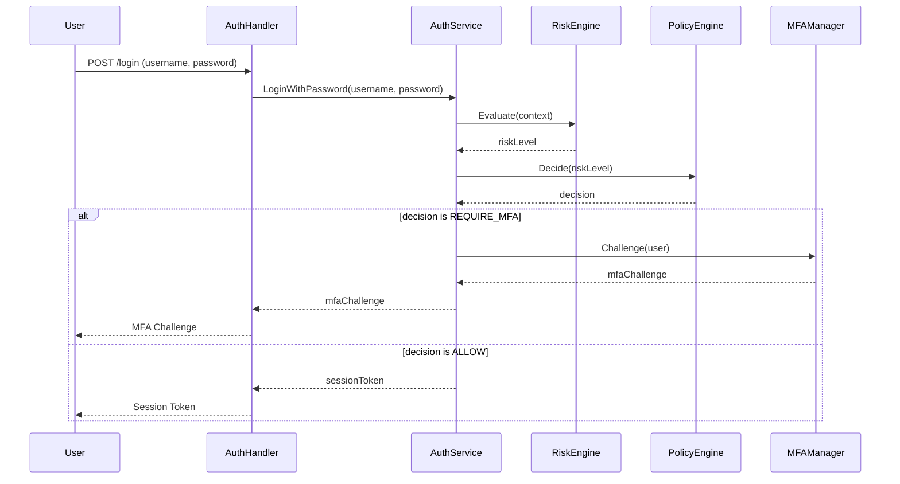

# P1: Authentication and MFA Flow

This document describes the implementation of the authentication and adaptive MFA flow for QuantaID.

## Overview

The authentication flow is orchestrated by the `auth.Service` in the domain layer. It follows these steps:

1.  **Login with Password**: The user provides their username and password.
2.  **Risk Assessment**: The `RiskEngine` assesses the risk of the login attempt based on various factors.
3.  **Policy Decision**: The `PolicyEngine` decides whether to allow the login, require MFA, or deny the login.
4.  **MFA Challenge**: If MFA is required, the `MFAManager` generates a challenge for the user.
5.  **MFA Verification**: The user provides the MFA code, which is verified by the `MFAManager`.
6.  **Session Creation**: If the login is successful, a new session and tokens are created.

## Sequence Diagram

## Key Components

| Component      | Path                                         | Description                                         |
| -------------- | -------------------------------------------- | --------------------------------------------------- |
| `AuthService`  | `internal/domain/auth/service.go`            | Orchestrates the authentication flow.               |
| `RiskEngine`   | `internal/auth/adaptive/risk_engine.go`      | Assesses the risk of a login attempt.               |
| `PolicyEngine` | `internal/auth/adaptive/policy_engine.go`    | Makes a policy decision based on the risk level.    |
| `MFAManager`   | `internal/auth/mfa/mfa_manager.go`           | Manages all MFA providers.                          |
| `AuthHandlers` | `internal/server/http/handlers/auth.go`      | Provides HTTP handlers for authentication endpoints. |
