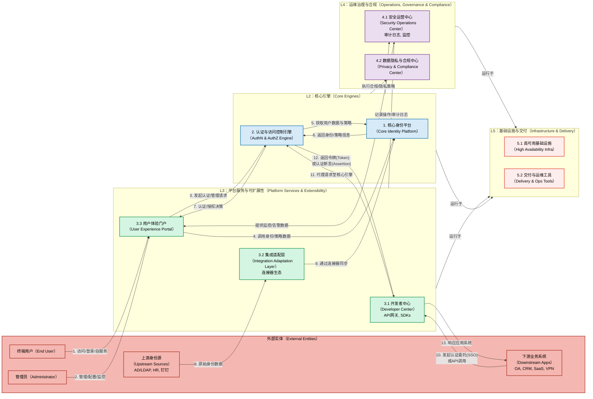

# **统一用户认证功能/能力全景图**

此全景图旨在阐明统一认证中台的核心模块及其相互之间的数据流与控制流关系，精确映射模块划分。

## **功能全景图**

### **全景图逻辑阐述**

此全景图将统一认证中台划分为四个逻辑层面，所有层面均构建于 **L5：基础设施与交付** 之上，确保平台的稳定运行和高效部署。

| 层面         | 核心模块                             | 角色与职责                               | 核心数据与控制流                                                                                                                                                                                  |
| :--------- | :------------------------------- | :---------------------------------- | :---------------------------------------------------------------------------------------------------------------------------------------------------------------------------------------- |
| **外部实体**   | 用户、管理员、上下游系统                     | 交互的发起方和能力的消费方。                      | 发起所有业务流程的起点和终点。                                                                                                                                                                           |
| **L3：接口层** | **3. 平台服务与可扩展性** | 作为中台的“门户”和“API层”，是所有外部实体与中台交互的统一入口。 | **控制流**：用户的登录和自服务请求通过`3.3 用户体验门户`进入；外部应用的SSO和API集成请求则通过`3.1 开发者中心`接入。 **数据流**：`3.2 集成适配层`的连接器负责从上游身份源拉取原始身份数据。                                                              |
| **L2：大脑层** | **1. 核心身份平台** & **2. 认证与访问控制引擎** | 作为中台的“决策中心”，负责处理所有核心的认证、授权和身份管理逻辑。  | **控制流**：`2. 认证与访问控制引擎`接收来自接口层的请求，执行MFA、风险评估、策略判断等认证和授权决策。 **数据流**：该引擎在决策时，会实时从`1. 核心身份平台`查询用户属性、凭据、策略等身份数据。核心身份平台则通过集成适配层，与上游身份源保持数据同步，确保自身是企业内 **唯一的身份事实来源（Single Source of Truth）**。 |
| **L4：支撑层** | **4. 运维治理与合规**               | 这是一个贯穿所有模块的“支撑骨架”，确保平台的安全、稳定和合规运行。  | **数据流**：所有上层模块在运行过程中产生的各类日志（用户登录、管理员操作等）都会被集中输送到`4.1 安全运营中心`进行结构化存储、监控和分析。 **控制流**：`4.2 数据隐私与合规中心`定义的策略（如数据脱敏）会反向约束核心引擎的数据处理方式。安全运营中心的监控告警信息会呈现在`3.3 用户体验门户`的管理控制台中。         |

**核心要点总结**：

* **分层解耦**：架构清晰地将 **用户交互 (L3)**、**核心决策 (L2)** 和 **运维支撑 (L4)** 分离，易于维护和扩展。
* **数据驱动**：**1. 核心身份平台** 是整个系统的数据基石，为上层的所有认证和授权决策提供数据支持。
* **策略集中**：**2. 认证与访问控制引擎** 是统一的策略执行点，确保所有应用和用户遵循一致的安全策略。
* **全面可观测**：**4.1 安全运营中心** 提供了全局的审计和监控视图，使所有行为都有据可查。
* **开放集成**：通过 **3.1 开发者中心** 和 **3.2 集成适配层**，平台具备了强大的南北向集成能力。

### **详细模块划分**
| 一级模块 (Primary Module)                                     | 二级模块 (Secondary Module)                               | 功能点/能力描述 (Features/Capabilities)                   |
| :-------------------------------------------------------- | :---------------------------------------------------- | :------------------------------------------------- |
| **1. 核心身份平台 (Core Identity Platform)**                    | **身份生命周期管理 (Identity Lifecycle Management)**          | • **用户目录服务**：本地用户存储、目录服务（LDAP）、分布式用户数据管理           |
|                                                           |                                                       | • **身份源同步引擎**：支持 AD/LDAP、HR系统、第三方系统的实时/批量同步        |
|                                                           |                                                       | • **多租户架构**：租户隔离、跨租户身份联邦、组织层级管理                    |
|                                                           |                                                       | • **Schema动态扩展**：用户属性自定义、业务字段扩展、数据模型版本管理           |
|                                                           |                                                       | • **智能生命周期策略**：基于规则的自动化用户创建、激活、禁用、删除流程             |
|                                                           | **身份数据治理 (Identity Data Governance)**                 | • **数据质量管理**：数据完整性检查、格式标准化、质量评分                    |
|                                                           |                                                       | • **身份去重与合并**：智能识别重复账户、身份关联与合并策略                   |
|                                                           |                                                       | • **身份画像构建**：基于行为数据的用户画像、风险评分、标签管理                 |
|                                                           | **身份联邦代理 (Identity Federation & Brokering)**          | • **上游身份提供商集成**：Azure AD、Okta、ADFS、社交登录等           |
|                                                           |                                                       | • **协议转换引擎**：多协议统一转换（SAML、OIDC、OAuth、CAS等）         |
|                                                           |                                                       | • **身份映射与转换**：属性映射、身份声明转换、跨域身份关联                   |
| **2. 认证与访问控制引擎 (Authentication & Access Control Engine)** | **多协议认证服务 (Multi-Protocol Authentication Service)**   | • **现代协议栈**：OAuth 2.0/OIDC、SAML 2.0、FIDO2/WebAuthn |
|                                                           |                                                       | • **传统协议支持**：RADIUS、LDAP Bind、Kerberos、TACACS+     |
|                                                           |                                                       | • **协议网关**：统一认证入口、协议适配、会话管理                        |
|                                                           | **智能多因素认证 (Intelligent Multi-Factor Authentication)** | • **认证器生态**：短信、邮件、TOTP、硬件Token、生物识别、推送认证           |
|                                                           |                                                       | • **自适应认证引擎**：基于风险的动态MFA策略、无感知安全增强                 |
|                                                           |                                                       | • **设备信任管理**：设备注册、信任评估、异常设备检测                      |
|                                                           | **零信任授权服务 (Zero Trust Authorization Service)**        | • **访问控制模型**：RBAC、ABAC、ReBAC混合模型支持                 |
|                                                           |                                                       | • **策略引擎**：细粒度策略定义、实时策略评估（集成OPA）                   |
|                                                           |                                                       | • **持续验证**：会话持续评估、权限动态调整、访问路径分析                    |
|                                                           | **威胁检测与响应 (Threat Detection & Response)**             | • **异常行为检测**：基于AI/ML的异常登录检测、行为基线分析                 |
|                                                           |                                                       | • **账户保护**：账户接管防护、暴力破解检测、Bot识别                     |
|                                                           |                                                       | • **自动响应**：威胁自动阻断、风险降级、安全事件通知                      |
| **3. 平台服务与可扩展性 (Platform Services & Extensibility)**      | **开发者中心 (Developer Center)**                          | • **统一API网关**：REST/GraphQL API、限流熔断、API版本管理        |
|                                                           |                                                       | • **插件化框架**：多语言SDK、自定义认证流程、业务逻辑扩展                  |
|                                                           |                                                       | • **集成工具链**：代码生成器、测试工具、文档生成                        |
|                                                           | **集成适配层 (Integration Adaptation Layer)**              | • **标准集成模式**：Agent部署、API调用、SDK嵌入、协议代理              |
|                                                           |                                                       | • **连接器生态**：预置主流应用连接器、自定义连接器开发                     |
|                                                           |                                                       | • **数据同步引擎**：实时/批量同步、增量更新、冲突处理                     |
|                                                           | **用户体验门户 (User Experience Portal)**                   | • **用户自服务中心**：密码自助重置、MFA设置、隐私控制、访问历史               |
|                                                           |                                                       | • **管理控制台**：用户管理界面、策略配置、实时监控、报表分析                  |
|                                                           |                                                       | • **移动端支持**：原生App、H5适配、移动设备管理                      |
| **4. 运维治理与合规 (Operations, Governance & Compliance)**      | **安全运营中心 (Security Operations Center)**               | • **审计日志服务**：全链路日志采集、结构化存储、智能检索                    |
|                                                           |                                                       | • **安全监控**：实时威胁监控、安全态势感知、告警响应                      |
|                                                           |                                                       | • **事件调查**：取证分析、事件重放、根因分析                          |
|                                                           | **数据隐私与合规中心 (Privacy & Compliance Center)**           | • **隐私保护**：数据脱敏、匿名化处理、最小权限原则                       |
|                                                           |                                                       | • **合规管理**：GDPR、CCPA、网安法等法规支持、同意管理                 |
|                                                           |                                                       | • **国密支持**：国密算法集成、密钥管理、安全通信                        |
|                                                           | **平台治理 (Platform Governance)**                        | • **配置管理**：安全策略模板、环境配置、版本控制                        |
|                                                           |                                                       | • **质量管理**：性能监控、可用性保障、容量规划                         |
|                                                           |                                                       | • **成本优化**：资源使用分析、成本分摊、优化建议                        |
| **5. 基础设施与交付 (Infrastructure & Delivery)**                | **高可用基础设施 (High Availability Infrastructure)**        | • **分布式架构**：多活部署、故障自愈、弹性伸缩                         |
|                                                           |                                                       | • **数据层**：数据库集群、缓存架构、存储优化                          |
|                                                           |                                                       | • **网络与安全**：负载均衡、SSL/TLS、防火墙集成                     |
|                                                           | **交付与运维工具 (Delivery & Operations Tools)**             | • **多形态交付**：容器化部署、二进制安装、云服务、SaaS模式                 |
|                                                           |                                                       | • **DevOps工具链**：CI/CD流水线、自动化测试、灰度发布                |
|                                                           |                                                       | • **运维自动化**：健康检查、自动扩缩容、备份恢复                        |

---

## **统一用户认证中台深度需求分析**

基于您提供的全部需求信息，经过专业的去重、精炼与科学梳理，现将逆向推理出的深层系统需求归纳如下。

| 系统模块/界面片段 (来自 统一用户认证中台模块划分)                                                      | 深层需求                                                                                                       | 枚举需求来源                       | 核心功能和 场景故事                                                                                                                                                                                                                                                                                   | 系统效果/用户价值                                                                                                                                                 | 备注/假设                                      |
| :------------------------------------------------------------------------------- | :--------------------------------------------------------------------------------------------------------- | :--------------------------- | :------------------------------------------------------------------------------------------------------------------------------------------------------------------------------------------------------------------------------------------------------------------------------------------- | :-------------------------------------------------------------------------------------------------------------------------------------------------------- | :----------------------------------------- |
| **1.1 核心身份平台 / 身份生命周期管理 / 身份源同步引擎**                              | **建立统一且权威的身份目录**：通过自动化的同步与整合机制，解决多系统间身份数据不一致、管理成本高昂、"幽灵账户"频现的核心痛点。                                         | 当前痛点 / 定制化 / 通用能力 / 从各系统UI分析 | **1. 高性能同步引擎**：支持百万级用户和组织架构的定时增量/全量同步，并提供数据预览与冲突解决机制。 **2. 可视化数据转换**：支持图形化的属性映射（如`AD.employeeID` -> `UAP.username`），并内置脚本引擎（如Lua）处理复杂的数据转换逻辑（如字段拼接、条件赋值）。 **场景故事**：当HR系统有新员工入职时，中台在5分钟内自动同步该员工信息，创建统一账户，并根据其部门和职位信息，预分配好OA和邮箱的初始访问权限，整个过程无需管理员手动干预。                 | • **建立唯一身份事实来源(SSoT)**，确保数据准确性与一致性。 • 将身份生命周期管理（入转离）的 **手动操作成本降低90%**。 • **安全提升**：确保离职员工的所有系统权限在1小时内被自动、完整回收。            | 假设中台有权限访问客户的各类身份源接口，并且网络可达。                |
| **1.3 核心身份平台 / 身份联邦代理**                                       | **打破组织与应用的信任边界**：作为企业统一的身份出口和入口，无缝集成上下游合作伙伴与云服务(SaaS)，实现安全的跨域单点登录(SSO)。                                    | 竞争力 / 从各系统UI分析 / 当前痛点 / 全球化  | **1. 多协议联邦网关**：同时支持作为IdP和SP，精通SAML 2.0, OIDC, OAuth 2.0, CAS等主流协议，并提供协议调试工具。 **2. 声明转换引擎**：提供灵活的属性映射和转换规则，适配各类非标SAML断言或OIDC声明，减少因协议“方言”导致的定制开发。 **3. 预置应用集成模板**：内置对主流云服务（如Azure AD, Okta, AWS）和国内应用（企业微信、钉钉）的SSO配置模板，实现快速集成。                                                   | • **提升用户体验**：用户使用一套企业凭证即可安全访问所有内外部授权应用。 • 将与合作伙伴建立身份联邦的 **配置时间从数天缩短至数小时**。 • **安全可控**：集中管控对所有第三方应用的访问授权与审计。                                         | 假设客户的合作伙伴或SaaS应用支持标准的身份联邦协议。               |
| **2.2 认证与访问控制引擎 / 智能多因素认证**                                | **在安全与便捷间取得最佳平衡**：提供丰富的认证器生态和基于风险的动态决策能力，为不同用户和场景提供恰如其分的认证强度。                                              | 当前痛点 / 从各系统UI分析 / 竞争力        | **1. 丰富的认证器“超市”**：内置支持短信/邮件OTP、TOTP(Google/Microsoft Authenticator)、硬件令牌、移动端推送/扫码/生物识别等多种认证方式。 **2. 自适应认证引擎**：允许管理员基于用户画像、设备可信度、IP地理位置、访问时间、应用敏感度等上下文信息，动态、自动地决策是否触发MFA以及采用何种MFA方式。 **场景故事**：财务总监在公司内网的可信设备上登录OA时，只需输入密码；当他在外出差使用酒店WiFi尝试登录财务系统时，系统自动要求其通过手机App进行指纹二次确认。 | • **显著提升账户安全**，有效抵御密码泄露和账户盗用风险。 • **降低MFA使用成本**：提供免费的TOTP认证方式，为客户 **节省高达80%的短信费用**。 • **智能风控**：在不牺牲低风险场景用户体验的前提下，精准加强高风险访问的安全防护。       | 假设移动端认证需要配套的App，并且风险评估引擎需要持续的数据输入和模型训练。    |
| **2.1 认证与访问控制引擎 / 多协议认证服务**                                                      | **保护并整合遗留系统投资**：提供对传统认证协议的广泛支持，将企业现有的网络设备、老旧应用等无缝纳管到统一的现代认证体系中。                                      | 通用能力 / 当前痛点 / 从各系统UI分析       | **1. 传统协议适配网关**：提供对RADIUS、LDAP Bind、TACACS+、Kerberos等协议的认证接入能力。 **2. 统一认证入口**：所有传统认证请求均可被代理到中台，由中台的策略引擎进行统一的认证和授权决策（如为SSH登录强制执行MFA）。 **场景故事**：运维人员通过SSH客户端登录服务器时，其认证请求被网络设备通过RADIUS协议转发至认证中台。中台验证其密码后，发现策略要求MFA，遂通过手机App向其推送一次确认请求，通过后才允许登录。                                           | • **利旧投资**：无需替换现有支持标准协议的网络设备和服务器，即可享受统一认证带来的安全增强。 • **扩大管控范围**：将认证能力从Web应用延伸至网络层和主机层，实现 **全面的身份访问管控**。 • **简化运维**：为所有设备和系统管理员提供统一的认证点和审计日志。 | 假设网络策略已配置为将认证请求指向认证中台。                     |
| **3.1 & 3.2 平台服务与可扩展性 / 开发者中心 & 集成适配层**                                   | **将“定制化”转变为“配置化”**：构建高度开放和可扩展的平台，将UI、身份源、认证流程等常见定制化需求，通过配置、低代码甚至插件化方式解决，从根本上降低交付成本、缩短交付周期。 | 当前痛点 / 定制化 / 竞争力             | **1. 可视化流程编排器**：提供低代码/无代码的拖拽式界面，允许管理员“画”出认证和授权流程图（如“判断->密码认证->审批->放行”），以应对复杂的业务场景。 **2. 插件化框架与SDK**：对外提供标准化的认证器（MFA）和连接器（身份源）开发工具包，允许二线团队或客户自行开发私有集成插件。 **3. 统一API网关**：暴露丰富的REST/GraphQL API，用于系统集成和二次开发。                                                               | • 预计将 **减少60%以上** 的认证相关定制开发工作量。 • 将新认证方式或身份源的 **平均交付周期从4周缩短至1周以内**。 • **赋能业务**：使非核心研发人员也能通过配置和低代码工具满足客户的个性化需求。                  | 假设各产品线和实施团队愿意投入少量资源学习新的配置和扩展方式，以换取长期的效率提升。 |
| **3.3 平台服务与可扩展性 / 用户体验门户**                                                | **赋能终端用户与管理员**：提供现代化的Web管理控制台和用户自服务中心，提升管理效率，并减少因密码重置、MFA设置等日常事务所带来的IT支持成本。                                | 通用能力 / 从各系统UI分析 / 定制化        | **1. 用户自服务中心**：允许用户自助完成密码重置、个人信息修改、MFA设备绑定/解绑、查看个人登录历史、管理应用授权等。 **2. 统一管理控制台**：为管理员提供用户管理、策略配置、应用集成、实时监控仪表板、报表分析等一站式管理功能。 **3. UI品牌化模板引擎**：允许管理员通过图形化界面上传Logo、修改CSS参数、调整文案，以适配客户VI规范。                                                                                                  | • **降低IT支持成本**：通过自助服务，可 **减少超过50%** 的密码重置相关工单。 • **提升管理效率**：集中的管理控制台避免了管理员在多个系统间切换，**操作效率提升30%**。 • **增强用户安全意识**：用户可自行审计登录历史，及时发现异常。                | -                                          |
| **4.1 & 2.4 运维治理与合规 / 安全运营中心 & 威胁检测与响应** | **实现全面的安全可见性与主动防御**：建立标准化的全链路审计体系和智能威胁检测能力，为安全事件的快速响应、根因分析和满足合规审查提供坚实基础。                                   | 当前痛点 / 合规要求 / 通用能力 / 竞争力     | **1. 结构化审计日志服务**：所有认证、授权、管理操作均产生格式统一（如CEF/JSON）的结构化日志，记录完整的“5W1H”信息。 **2. 日志上报与集成**：提供Syslog, Kafka等标准接口，将审计日志实时对接到企业统一的SIEM平台。 **3. 异常行为检测**：内置基于AI/ML的异常登录检测模型（如异地登录、暴力破解、账户盗用），并支持配置自动响应动作（如阻断、降级、通知）。                                                                        | • **提升安全事件响应效率**：标准化的日志使跨系统溯源分析的 **时间从数小时缩短到分钟级**。 • **满足合规性**：提供不可篡改的审计追踪，满足等级保护、GDPR等法规的审计要求。 • **主动防御**：从被动审计转向主动威胁检测，变“事后追查”为“事中拦截”。            | 假设企业有统一的SIEM平台，或中台内置的日志检索分析能力足够强大。         |
| **4.2 运维治理与合规 / 数据隐私与合规中心**                                                      | **支撑全球化业务与满足数据法规**：内置对国际主流数据隐私法规的支持，确保产品在不同国家和地区的合规性，扫清出海障碍。                                    | 全球化 / 合规要求 / 竞争力             | **1. 合规框架支持**：内置对GDPR、CCPA、网安法等法规的支持，提供如数据主体权利响应（如被遗忘权接口）、同意管理、数据本地化存储等功能。 **2. 隐私保护设计**：默认遵循数据脱敏、最小权限等隐私保护原则。 **3. 国密算法支持**：为满足国内特殊行业的安全要求，提供国密算法的集成与支持。                                                                                                                   | • **扫清产品出海的身份认证与合规障碍**，加速全球业务布局。 • **降低合规风险**，避免因违反数据隐私法规而导致的巨额罚款。 • **提升客户信任**：将合规与隐私保护作为产品的核心竞争力。                                                 | GDPR等合规性要求需作为顶层设计，贯穿于数据生命周期的全流程。           |
| **5.2 基础设施与交付 / 交付与运维工具**                                                        | **灵活适应多样化的部署环境**：提供轻量化、多形态的交付模式，解决现有组件过重、技术栈冲突、难以被“盒子”类产品集成的问题，降低各业务线的集成门槛。                                | 当前痛点 / 内部需求                  | **1. 轻量化核心引擎**：核心认证服务无重度中间件依赖，资源占用低，可在资源受限的环境高效运行。 **2. 多形态交付**：支持以独立二进制文件、轻量级Docker容器、SDK/Library等多种形式交付，以适应私有化、SaaS、硬件一体机等不同部署场景。 **3. DevOps工具链集成**：提供标准化的CI/CD流水线、自动化测试框架和健康检查接口，实现快速、可靠的部署和运维。                                                                                    | • **大幅降低** 产品线的集成门槛和资源开销。 • **提升交付效率**：标准化的交付物和自动化工具链，将部署和升级的 **时间缩短70%**。 • **架构解耦**：核心引擎可独立于宿主产品进行升级和打补丁，提升安全响应速度。               | 假设中台将采用云原生和微服务架构进行设计。                      |

## 可集成的能力

| **可与外部系统集成/客户（产品）自提供的能力**                                                   | **所属模块**    | **集成/复用说明**                                                                               | **分析依据**                                                                                                                                                                                                                      |
| :---------------------------------------------------------------------- | :--------------- | :---------------------------------------------------------------------------------------- | :---------------------------------------------------------------------------------------------------------------------------------------------------------------------------------------------------------------------------- |
| **身份主数据源**   (Master Identity Source)                                | **1. 核心身份平台**    | 中台通过同步引擎从外部系统（如HR、Active Directory/LDAP、钉钉）获取身份数据。权威的身份创建和维护流程可以保留在这些源头系统中，中台负责聚合与同步。     | **外部实体**: `SOURCE_SYS[上游身份源` `（Upstream Sources）` `AD/LDAP, HR, 钉钉]` **功能点**: `身份源同步引擎：支持 AD/LDAP、HR系统、第三方系统的实时/批量同步` |
| **上游身份认证服务**   (Upstream Authentication Service)                     | **1. 核心身份平台**    | 当企业已经使用如Azure AD、Okta等云身份提供商时，中台可作为身份联邦代理，将认证请求委托给这些外部IdP，复用其认证能力，实现对云服务的无缝单点登录。          | **功能点**: `上游身份提供商集成：Azure AD、Okta、ADFS、社交登录等`                                                                                                                                                        |
| **底层基础设施**   (Underlying Infrastructure)                             | **5. 基础设施与交付**   | 中台作为应用系统，需要部署在底层基础设施之上。这些基础设施（如数据库集群、缓存服务、负载均衡器、防火墙）通常由客户根据其IT标准统一提供和运维。                  | **功能点**: `数据层：数据库集群、缓存架构`   `网络与安全：负载均衡、SSL/TLS、防火墙集成`                                                                                                                                                        |
| **日志审计与安全分析平台 (SIEM)**   (Log Auditing & Security Analysis Platform) | **4. 运维治理与合规**   | 中台自身负责产生标准化的、结构化的审计日志，但对于日志的长期存储、深度分析、安全事件告警和响应，通常会集成企业统一的SIEM平台（如Splunk, QRadar）。        | **深层需求分析**: `日志上报与集成：提供Syslog, Kafka等标准接口，将审计日志实时对接到企业统一的SIEM平台。`                                                                                                                                                   |
| **消息通知服务**   (Message Notification Services)                     | **2. 认证与访问控制引擎** | 在执行多因素认证（MFA）或发送安全事件通知时，中台需要调用外部消息服务。例如，短信验证码依赖客户的**短信网关**，邮件通知则需要集成客户的**邮件服务器(SMTP服务)**。 | **功能点**: `认证器生态：短信、邮件、...、推送认证` (虽未明说，但这些认证器实现必然依赖外部网关或服务)                                                                                                                                                                  |
| **DevOps工具链**   (DevOps Toolchain)                                   | **5. 基础设施与交付**   | 产品的持续集成、自动化测试和持续部署（CI/CD）流程，可以与客户现有的DevOps平台（如Jenkins, GitLab CI）进行集成，以适应客户的研运体系。         | **功能点**: `DevOps工具链：CI/CD流水线、自动化测试、灰度发布`                                                                                                                                                                          |
| **密钥管理系统 (KMS)**   (Key Management System)                           | **4. 运维治理与合规**   | 对于需要国密算法支持或有更高安全要求的场景，中台的密钥管理可以与企业级的硬件加密机(HSM)或密钥管理系统(KMS)集成，以确保密钥的安全存储和生命周期管理。           | **功能点**: `国密支持：国密算法集成、密钥管理、安全通信` (企业级密钥管理通常会集成专用的KMS/HSM)                                                                                                                                                                  |

## 高定制化识别

| 高定制化可能性的模块/能力 (Module/Capability with High Customization Potential)                       | 定制化原因分析 (Reason for Customization)                                                                                                                                                                                              | 典型定制化需求举例 (Example Customization Requests)                                                                                                                                                                                     | 分析依据 (Source from Text)                                                                                                                                                                                        |
| :---------------------------------------------------------------------------------------- | :------------------------------------------------------------------------------------------------------------------------------------------------------------------------------------------------------------------------------ | :----------------------------------------------------------------------------------------------------------------------------------------------------------------------------------------------------------------------------- | :------------------------------------------------------------------------------------------------------------------------------------------------------------------------------------------------------------- |
| **1. 身份源同步与数据转换** (Identity Source Sync & Data Transformation)                         | • **数据源异构**：客户的HR、AD、LDAP等系统 schema 各不相同，字段定义、组织层级、用户状态（在职、离职、休假）的表示方式千差万别。 • **复杂转换逻辑**：简单的字段映射无法满足需求，常涉及条件判断、字段拼接、数据清洗、默认值填充等复杂的业务逻辑。 • **遗留系统接口**：部分老旧身份源可能没有标准API，需要通过数据库直连、文件交换(CSV/JSON)等非标方式进行同步。          | • **HR系统对接**：为客户特定的HR系统（如用友、金蝶）开发专用连接器。 • **自定义同步规则**：实现“当HR系统用户状态为‘长期病假’且AD账户已禁用超过90天时，才删除中台账户”这类复杂生命周期逻辑。 • **属性转换脚本**：编写脚本将AD的 `manager` 字段（DN格式）转换为中台的用户ID格式。                                                        | • `1.1 核心身份平台 / 身份生命周期管理 / 身份源同步引擎` • `1.1 ... / Schema动态扩展` • `3.2 ... / 连接器生态：预置主流应用连接器、自定义连接器开发`                                                                          |
| **2. 认证协议的适配与扩展** (Authentication Protocol Adaptation & Extension)                     | • **协议“方言”**：SAML、OIDC等虽是标准协议，但在实际应用中存在大量“方言”。不同厂商的应用对断言(Assertion)或声明(Claim)的结构、加密方式、签名算法有特殊要求。 • **陈旧/私有协议**：客户可能有大量依赖RADIUS、CAS 1.0/2.0，甚至自研SSO协议的旧应用需要利旧。 • **非标认证流程**：例如，在OAuth 2.0流程中需要额外调用一个内部API来验证用户的业务状态。 | • **非标SAML应用集成**：适配某OA系统只接受特定格式SAML断言的需求，需要定制声明转换规则。 • **RADIUS协议扩展**：为支持需要特殊RADIUS Vendor-Specific Attributes (VSA)的网络设备（如VPN）进行定制。 • **私有协议网**私有协议网关**：为客户自研的C/S架构应用开发一个认证代理，将其私有登录协议转换为OIDC。          | • `1.3 核心身份平台 / 身份联邦代理 / 协议转换引擎` • `2.1 认证与访问控制引擎 / 多协议认证服务` `• 3.1 ... / 插件化框架：...自定义认证流程`                                                                                  |
| **3. 认证与授权流程编排** (Authentication & Authorization Flow Orchestration)    | • **业务流程强相关**：认证和授权逻辑与客户具体的业务场景和风控策略紧密绑定，标准化流程难以覆盖所有需求。 • **动态与上下文相关**：客户希望根据用户角色、设备、地点、时间、操作风险等级等组合条件，动态决策认证流程（如是否MFA、审批流）。                                                                                                 | • **动态审批流**：用户申请访问高敏系统权限时，需要根据申请人的部门和级别，自动流转给对应的部门经理和应用Owner审批。 • **注册流程定制**：外部合作伙伴注册时，需要先通过企业征信API校验，再发送邀请邮件，整个流程需要定制编排。 • **自适应认证策略**：实现“财务人员在工作时间、公司内网访问财务系统，则免MFA；若在非工作时间或外网访问，则必须加推送到App的生物识别认证”的场景。 | • `2.2 ... / 自适应认证引擎：基于风险的动态MFA策略` • `2.3 ... / 策略引擎：细粒度策略定义` • `3.1 & 3.2 ... / 可视化流程编排器：提供低代码/无代码的拖拽式界面，允许管理员“画”出认证和授权流程图` |
| **4. 用户体验门户(UI)的品牌化与功能扩展** (Branding & Functional Extension of User Experience Portal) | • **企业VI统一**：客户强烈要求登录门户、自服务中心等所有面向用户的界面，必须与其企业视觉识别系统（VI）完全一致，包括Logo、颜色、字体、布局和文案。 • **功能嵌入**：希望在自服务门户中嵌入企业已有的其他功能入口，如“IT服务单提报”、“公司公告”等。 • **移动端适配**：对移动端（原生App, H5）的交互体验有特殊的定制要求。                                          | • **登录页完全重构**：根据客户提供的UI设计稿，像素级还原一个全新的登录页面，而非简单的Logo替换。 • **自服务功能增加**：在自服务中心增加一个“我的设备”管理页面，允许用户查看和解绑其所有登录过的设备。 • **文案与国际化**：修改所有界面的提示文案以符合企业口吻，并增加对特定语种（如繁体中文、日语）的支持。                                                     | • `3.3 平台服务与可扩展性 / 用户体验门户` • `深层需求分析 / UI品牌化模板引擎：允许管理员通过图形化界面上传Logo、修改CSS参数、调整文案`                                                                  |
