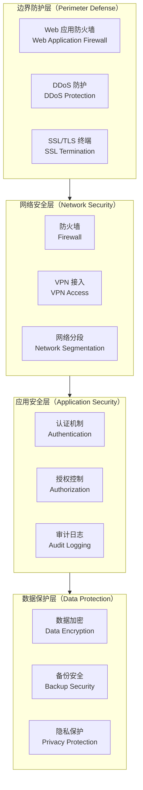
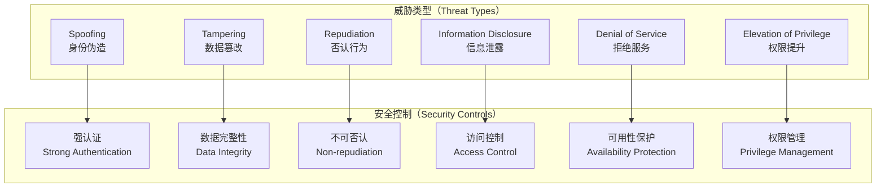
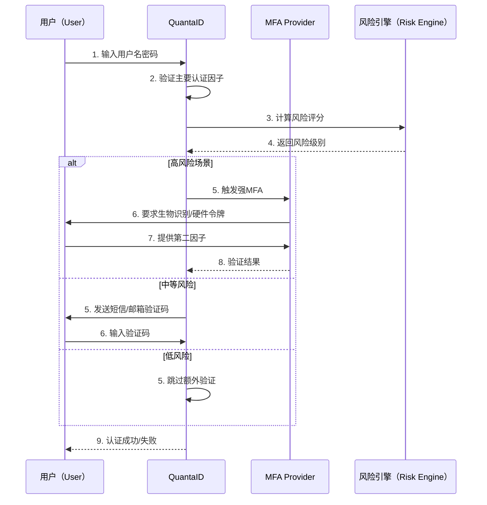
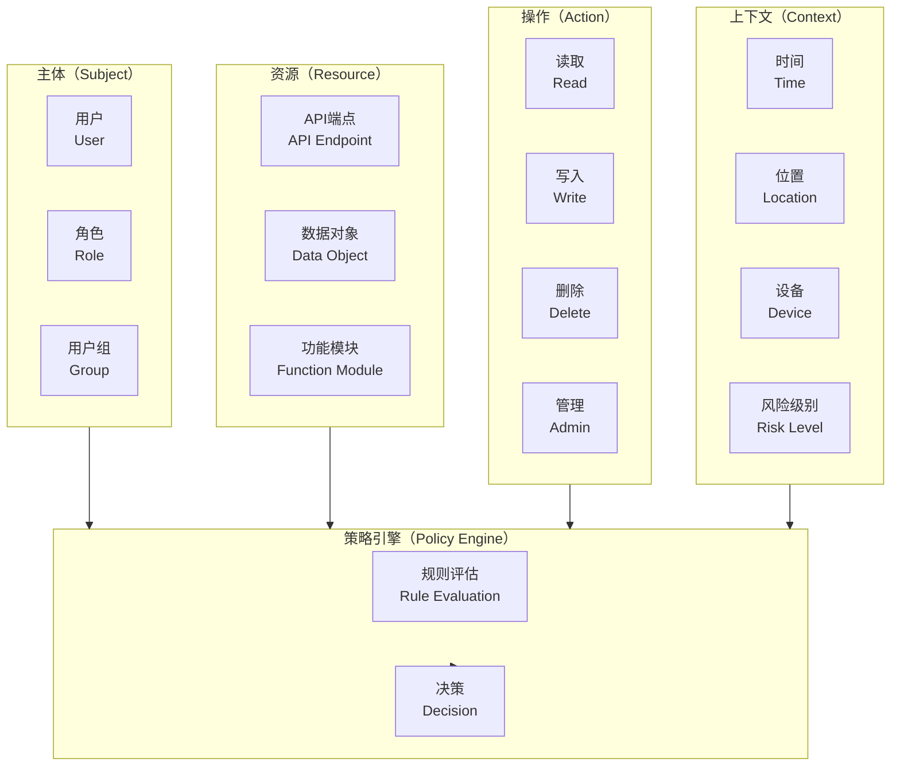
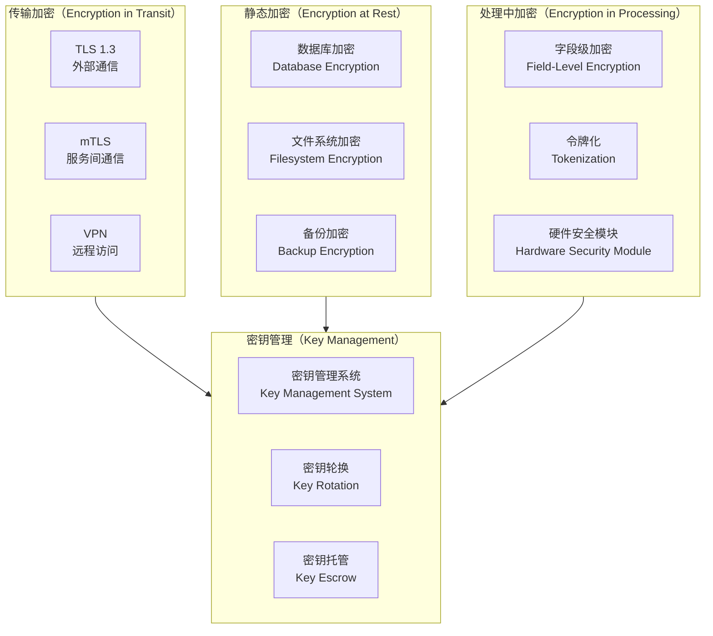
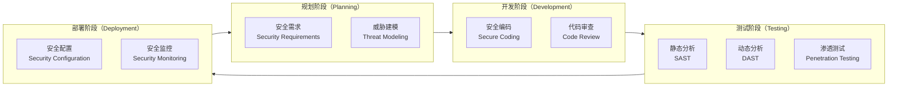
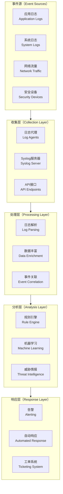
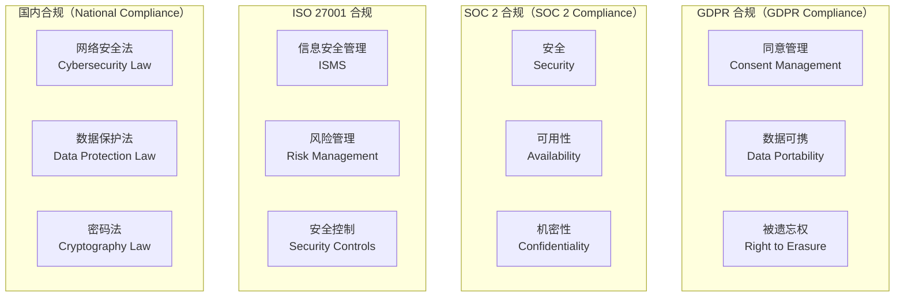
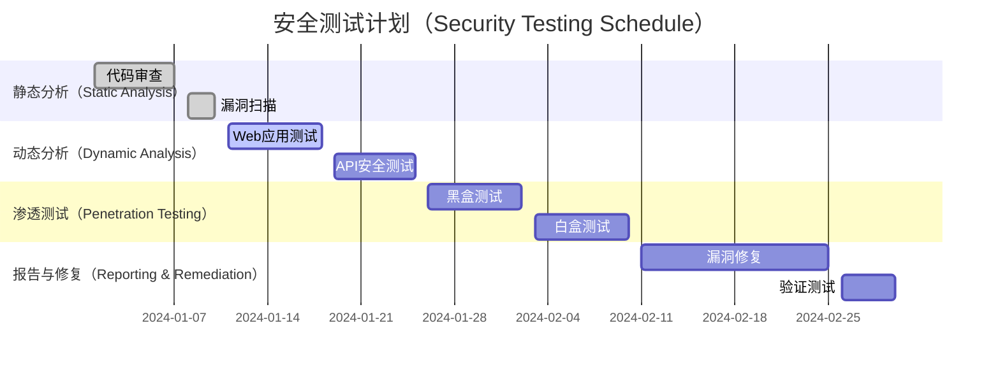
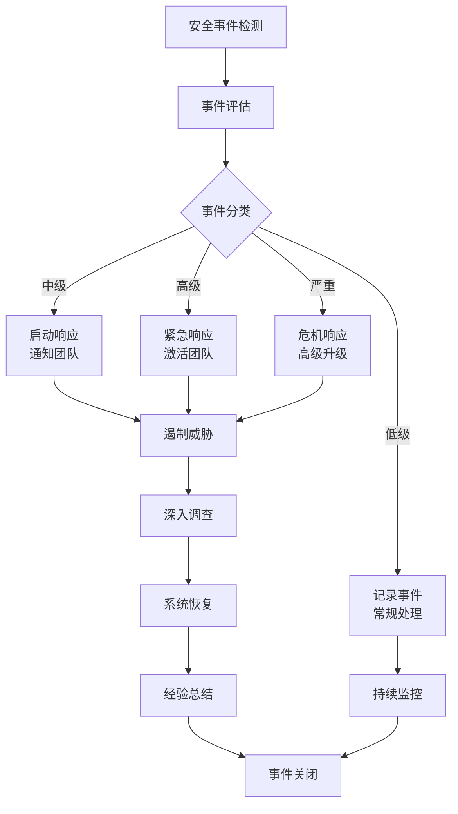

# QuantaID 安全指南

## 概述

QuantaID 采用"安全设计优先"的理念，在架构、实现和部署的每个环节都内置了全面的安全防护措施。本文档详细说明了 QuantaID 的安全架构、威胁防护机制以及安全运营最佳实践。

## 安全架构设计

### 多层防御体系



### 零信任安全模型

QuantaID 基于零信任原则设计，不信任任何网络位置或设备：

| 零信任原则     | QuantaID 实现    | 安全价值     |
| --------- | -------------- | -------- |
| 验证所有用户和设备 | 强制多因素认证、设备指纹识别 | 防止身份伪造   |
| 最小权限访问    | 细粒度权限控制、动态权限调整 | 降低权限滥用风险 |
| 持续验证      | 会话持续监控、行为分析    | 实时威胁检测   |
| 微分段网络     | API 网关、服务网格    | 限制攻击传播   |

## 威胁模型分析

### STRIDE 威胁建模



### 攻击面分析

| 攻击面     | 潜在威胁           | 防护措施             |
| ------- | -------------- | ---------------- |
| Web API | SQL注入、XSS、CSRF | 输入验证、输出编码、CSRF令牌 |
| 认证流程    | 密码攻击、会话劫持      | 强密码策略、会话保护       |
| 权限系统    | 权限提升、越权访问      | 最小权限原则、权限审计      |
| 数据存储    | 数据泄露、篡改        | 加密存储、完整性校验       |
| 网络通信    | 中间人攻击、窃听       | TLS加密、证书校验       |
| 系统组件    | 依赖漏洞、配置错误      | 漏洞扫描、安全基线        |

## 身份认证安全

### 多因素认证（MFA）



### 密码安全策略

```yaml
# 密码策略配置
password_policy:
  min_length: 12
  max_length: 128
  require_uppercase: true
  require_lowercase: true
  require_numbers: true
  require_special_chars: true
  disallow_common_passwords: true
  disallow_personal_info: true
  password_history: 12
  max_age_days: 90
  lockout_attempts: 5
  lockout_duration: 900  # 15分钟
  
# 密码强度检查
password_strength:
  entropy_threshold: 50
  dictionary_check: true
  keyboard_pattern_check: true
  repeated_char_limit: 3
```

### 会话管理安全

```go
// 安全会话配置
type SessionConfig struct {
    // 会话超时
    IdleTimeout    time.Duration `yaml:"idle_timeout"`     // 30分钟
    AbsoluteTimeout time.Duration `yaml:"absolute_timeout"` // 8小时
    
    // 会话安全
    SecureCookie   bool   `yaml:"secure_cookie"`    // 仅HTTPS
    HTTPOnly       bool   `yaml:"http_only"`        // 禁止JS访问
    SameSite       string `yaml:"same_site"`        // CSRF保护
    
    // 会话绑定
    BindToIP       bool   `yaml:"bind_to_ip"`       // IP绑定
    BindToUserAgent bool  `yaml:"bind_to_ua"`       // User-Agent绑定
    
    // 会话轮换
    RegenerateOnAuth bool `yaml:"regenerate_on_auth"` // 认证后重新生成
    RegenerateInterval time.Duration `yaml:"regenerate_interval"` // 定期轮换
}
```

## 授权与访问控制

### 基于属性的访问控制（ABAC）



### 权限策略示例

```rego
# Open Policy Agent (OPA) 策略
package quantaid.authz

import future.keywords.if
import future.keywords.in

# 默认拒绝
default allow = false

# 管理员拥有所有权限
allow if {
    input.user.roles[_] == "admin"
}

# 用户只能访问自己的数据
allow if {
    input.action == "read"
    input.resource.type == "user"
    input.resource.id == input.user.id
}

# 工作时间限制策略
allow if {
    input.user.roles[_] == "employee"
    is_business_hours
    not is_high_risk_action
}

is_business_hours if {
    hour := time.clock(time.now_ns())[0]
    hour >= 8
    hour <= 18
}

is_high_risk_action if {
    input.action in ["delete", "admin"]
}

# 地理位置限制
allow if {
    input.user.location.country in allowed_countries
    not input.user.risk_score > 0.7
}

allowed_countries := ["CN", "US", "GB", "JP"]
```

## 数据保护

### 加密策略



### 敏感数据分类

| 数据分类 | 数据类型       | 加密要求      | 访问控制  |
| ---- | ---------- | --------- | ----- |
| 公开数据 | 产品文档、API文档 | 无要求       | 公开访问  |
| 内部数据 | 配置信息、日志数据  | TLS传输     | 内部员工  |
| 机密数据 | 用户信息、权限数据  | AES-256加密 | 授权用户  |
| 高度机密 | 密码哈希、认证密钥  | HSM保护     | 系统管理员 |

### 数据脱敏与匿名化

```go
// 数据脱敏接口
type DataMasker interface {
    MaskEmail(email string) string
    MaskPhone(phone string) string
    MaskName(name string) string
    MaskSensitiveFields(data interface{}) interface{}
}

// 实现示例
func (m *defaultMasker) MaskEmail(email string) string {
    if len(email) == 0 {
        return ""
    }
    
    parts := strings.Split(email, "@")
    if len(parts) != 2 {
        return "***@***"
    }
    
    username := parts[0]
    domain := parts[1]
    
    if len(username) <= 2 {
        return "***@" + domain
    }
    
    return username[:1] + "***" + username[len(username)-1:] + "@" + domain
}
```

## 漏洞管理

### 安全开发生命周期（SSDLC）



### 漏洞扫描与修复

```bash
#!/bin/bash
# vulnerability_scan.sh

# 依赖漏洞扫描
echo "Scanning Go module vulnerabilities..."
govulncheck ./...

# 静态代码分析
echo "Running static analysis..."
gosec -fmt json -out gosec-report.json ./...

# Docker镜像扫描
echo "Scanning Docker image..."
trivy image --format json --output trivy-report.json quantaid/quantaid:latest

# 生成安全报告
echo "Generating security report..."
python3 scripts/generate_security_report.py \
  --gosec gosec-report.json \
  --trivy trivy-report.json \
  --output security-report.html
```

## 安全监控与响应

### 安全事件监控



### 安全指标与KPI

| 指标类别 | 指标名称     | 目标值     | 监控频率 |
| ---- | -------- | ------- | ---- |
| 认证安全 | 认证成功率    | ≥ 99.5% | 实时   |
| 认证安全 | MFA覆盖率   | ≥ 95%   | 每日   |
| 权限管理 | 权限违规事件   | < 5/月   | 每日   |
| 漏洞管理 | 高危漏洞修复时间 | < 24小时  | 每周   |
| 事件响应 | 安全事件响应时间 | < 1小时   | 实时   |
| 合规性  | 审计日志完整性  | 100%    | 每日   |

### 自动化安全响应

```yaml
# 安全响应规则配置
security_rules:
  - name: "暴力破解检测"
    condition: "failed_login_count > 10 AND time_window < 300s"
    actions:
      - type: "block_ip"
        duration: "3600s"
      - type: "alert"
        severity: "high"
      - type: "disable_account"
        duration: "1800s"
  
  - name: "异常地理位置登录"
    condition: "login_location != user.usual_locations AND risk_score > 0.8"
    actions:
      - type: "require_mfa"
        method: "webauthn"
      - type: "alert"
        severity: "medium"
      - type: "notify_user"
        channel: "email"
  
  - name: "权限提升检测"
    condition: "role_change AND !approved_workflow"
    actions:
      - type: "revert_changes"
      - type: "alert"
        severity: "critical"
      - type: "create_incident"
```

## 合规性与审计

### 合规框架支持



### 审计日志规范

```json
{
  "timestamp": "2024-01-15T10:30:15.123Z",
  "event_id": "evt_1234567890abcdef",
  "event_type": "authentication",
  "event_name": "user_login_success",
  "severity": "info",
  "source": {
    "service": "quantaid-server",
    "version": "1.2.3",
    "instance_id": "qid-prod-01"
  },
  "actor": {
    "user_id": "user_12345",
    "username": "john.doe@example.com",
    "session_id": "sess_abcdef123456",
    "ip_address": "192.168.1.100",
    "user_agent": "Mozilla/5.0..."
  },
  "target": {
    "resource_type": "application",
    "resource_id": "app_dashboard",
    "resource_name": "Corporate Dashboard"
  },
  "action": {
    "type": "authentication",
    "method": "saml_sso",
    "result": "success",
    "details": {
      "provider": "corporate_idp",
      "mfa_used": true,
      "risk_score": 0.2
    }
  },
  "metadata": {
    "trace_id": "trace_xyz789",
    "correlation_id": "corr_456123",
    "environment": "production",
    "data_classification": "internal"
  }
}
```

## 安全配置基线

### 服务器安全配置

```bash
#!/bin/bash
# security_hardening.sh

# 禁用不必要的服务
systemctl disable cups
systemctl disable avahi-daemon
systemctl disable bluetooth

# 配置防火墙
ufw --force enable
ufw default deny incoming
ufw default allow outgoing
ufw allow ssh
ufw allow 443/tcp

# SSH安全配置
cat >> /etc/ssh/sshd_config << 'EOF'
Protocol 2
PermitRootLogin no
PasswordAuthentication no
PubkeyAuthentication yes
MaxAuthTries 3
ClientAliveInterval 300
ClientAliveCountMax 2
EOF

# 内核参数优化
cat >> /etc/sysctl.d/99-security.conf << 'EOF'
# 网络安全
net.ipv4.ip_forward = 0
net.ipv4.conf.all.send_redirects = 0
net.ipv4.conf.all.accept_redirects = 0
net.ipv4.conf.all.accept_source_route = 0
net.ipv4.icmp_ignore_bogus_error_responses = 1

# SYN洪水攻击防护
net.ipv4.tcp_syncookies = 1
net.ipv4.tcp_max_syn_backlog = 2048
net.ipv4.tcp_synack_retries = 3

# 日志记录
kernel.dmesg_restrict = 1
kernel.kptr_restrict = 2
EOF
```

### 应用安全配置

```yaml
# 应用安全基线配置
security:
  # HTTP安全头
  security_headers:
    strict_transport_security: "max-age=31536000; includeSubDomains"
    x_frame_options: "DENY"
    x_content_type_options: "nosniff"
    x_xss_protection: "1; mode=block"
    referrer_policy: "strict-origin-when-cross-origin"
    content_security_policy: "default-src 'self'; script-src 'self' 'unsafe-inline'"
  
  # CORS配置
  cors:
    allowed_origins: ["https://dashboard.example.com"]
    allowed_methods: ["GET", "POST", "PUT", "DELETE"]
    allowed_headers: ["Authorization", "Content-Type"]
    max_age: 3600
  
  # 速率限制
  rate_limiting:
    global_limit: "1000r/m"
    per_ip_limit: "100r/m"
    auth_limit: "10r/m"
    burst_size: 50
  
  # 输入验证
  input_validation:
    max_request_size: "10MB"
    max_json_depth: 10
    sanitize_html: true
    validate_json_schema: true
```

## 安全测试

### 渗透测试计划



### 安全测试用例

```python
# security_tests.py
import pytest
import requests
from selenium import webdriver

class TestSecurityControls:
    def test_sql_injection_protection(self):
        """测试SQL注入防护"""
        payload = "'; DROP TABLE users; --"
        response = requests.post('/api/v1/users/search', 
                               json={'query': payload})
        assert response.status_code != 500
        assert 'error' not in response.json()
    
    def test_xss_protection(self):
        """测试XSS防护"""
        payload = "<script>alert('xss')</script>"
        response = requests.post('/api/v1/users',
                               json={'display_name': payload})
        # 验证输出被正确编码
        user = response.json()
        assert '<script>' not in user['display_name']
    
    def test_authentication_bypass(self):
        """测试认证绕过"""
        # 尝试不带token访问受保护资源
        response = requests.get('/api/v1/admin/users')
        assert response.status_code == 401
        
        # 尝试使用无效token
        headers = {'Authorization': 'Bearer invalid-token'}
        response = requests.get('/api/v1/admin/users', headers=headers)
        assert response.status_code == 401
    
    def test_rate_limiting(self):
        """测试速率限制"""
        # 快速发送多个请求
        for i in range(101):  # 超过限制
            response = requests.post('/api/v1/auth/login',
                                   json={'username': 'test', 'password': 'test'})
        
        # 最后的请求应该被限制
        assert response.status_code == 429
    
    def test_session_security(self):
        """测试会话安全"""
        # 登录获取会话
        response = requests.post('/api/v1/auth/login',
                               json={'username': 'testuser', 'password': 'password'})
        
        # 验证Cookie安全属性
        cookie = response.cookies.get('session')
        assert cookie.secure == True
        assert cookie.httponly == True
```

## 应急响应

### 安全事件响应流程



### 应急联系清单

| 角色     | 职责       | 联系方式                                                            | 响应时间 |
| ------ | -------- | --------------------------------------------------------------- | ---- |
| 首席安全官  | 整体安全策略决策 | [security-chief@company.com](mailto:security-chief@company.com) | 1小时  |
| 安全运营经理 | 事件响应协调   | [security-ops@company.com](mailto:security-ops@company.com)     | 30分钟 |
| 系统管理员  | 系统紧急处置   | [sysadmin@company.com](mailto:sysadmin@company.com)             | 15分钟 |
| 法务顾问   | 合规和法律事务  | [legal@company.com](mailto:legal@company.com)                   | 2小时  |
| 公关经理   | 外部沟通     | [pr@company.com](mailto:pr@company.com)                         | 4小时  |

## 参考资料

[1] OWASP Top 10 Security Risks - [https://owasp.org/www-project-top-ten/](https://owasp.org/www-project-top-ten/)

[2] NIST Cybersecurity Framework - [https://www.nist.gov/cyberframework](https://www.nist.gov/cyberframework)

[3] ISO/IEC 27001:2013 Information Security Management - [https://www.iso.org/standard/54534.html](https://www.iso.org/standard/54534.html)

[4] GDPR Regulation Text - [https://gdpr-info.eu/](https://gdpr-info.eu/)

[5] SANS Security Policies - [https://www.sans.org/information-security-policy/](https://www.sans.org/information-security-policy/)

[6] MITRE ATT&CK Framework - [https://attack.mitre.org/](https://attack.mitre.org/)

[7] Zero Trust Architecture - NIST SP 800-207

[8] PCI DSS Requirements - [https://www.pcisecuritystandards.org/](https://www.pcisecuritystandards.org/)